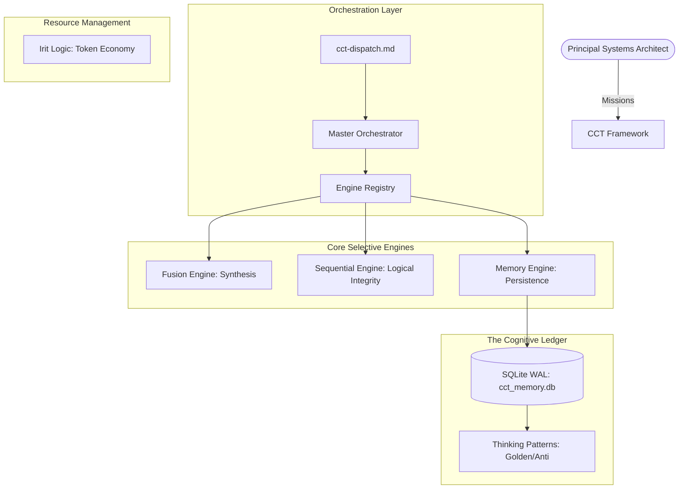

# Architecture Overview: Cognitive OS v5.0

## High-Level Purpose

The **Creative Critical Thinking (CCT) Framework** is a multi-layered reasoning engine that transforms standard LLM outputs into hardened architectural artifacts. It moves from "Stateless Completions" to "Persistent Sessions".

## Structural Hierarchy

## Key Components

1.  **Master Orchestrator**: The decision brain that parses missions and selects the appropriate strategy via the `Engine Registry`.
2.  **Adaptive Routing**: Dynamically pivots between thinking modes (e.g., from `tree` to `actor-critic`) based on real-time quality scores.
3.  **Sequential Integrity**: Ensures no steps are skipped and maintains a clear, forensic audit trail of all cognitive transitions.
4.  **Cognitive Ledger (SQLite)**: Persists all thoughts, scores, and patterns using thread-safe, WAL-mode persistence.

## Related Topics
- [Technical Standard](./technical-standard.md)
- [Engine System](./engine-system.md)
- [../Models/context.md](../models/context.md)
