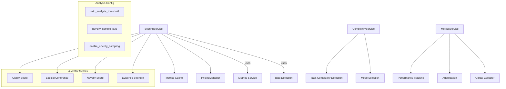

# How Analysis Works

The Analysis services provide cognitive quality evaluation, complexity detection, and performance metrics for CCT's reasoning processes. This guide explains how CCT analyzes thoughts to ensure quality, manage costs, and optimize performance.

## Overview

CCT's analysis layer provides comprehensive cognitive evaluation through:
- **ScoringService**: 4-vector quality metrics (Clarity, Coherence, Novelty, Evidence)
- **ComplexityService**: Task complexity detection for mode selection
- **MetricsService**: Performance tracking and aggregation
- **Bias Detection**: Cognitive bias flagging
- **Token Optimization**: Budget-aware analysis with caching

**Key Features:**
- **Token-Efficient**: 4000 token budget for analysis with caching
- **Multi-Dimensional**: 4-vector metrics for comprehensive quality assessment
- **Budget-Aware**: Cost calculation for all thoughts
- **Sampling-Based**: Efficient novelty detection for large histories
- **Incremental**: Session-level analysis without re-processing

## Architecture



## Core Components

### ScoringService

**Location**: `src/core/services/analysis/scoring.py` (lines 25-325)

The `ScoringService` provides token-efficient cognitive performance evaluation with budget awareness and caching.

**4-Vector Metrics:**

**1. Clarity Score**
```python
clarity = clarity_score(content)
```
Measures syntactic quality and precision. Higher clarity indicates clearer, more readable content.

**2. Logical Coherence**
```python
coherence = self._calculate_coherence(thought, history, content)
```
Measures how well the current thought logically connects to its parent thought.

**Coherence Algorithm:**
```python
if not thought.parent_id:
    return 0.7  # Root thought assumption

parent = next((t for t in history if t.id == thought.parent_id), None)
if not parent:
    return 0.5  # Broken link assumption

sim = cosine_similarity(content, parent.content)

# Heuristic thresholds
if 0.3 < sim < 0.8:
    return 0.9  # High coherence - optimal balance
elif sim > 0.9:
    return 0.4  # Low coherence - too repetitive
else:
    return 0.5  # Low coherence - too disconnected
```

**3. Novelty Score**
```python
novelty = self._calculate_novelty(content, history)
```
Measures how unique the current thought is compared to history. Higher novelty indicates more original content.

**Novelty Algorithm:**
```python
if not history:
    return 1.0  # Maximum novelty for first thought

# Sampling for large histories
if self.config.enable_novelty_sampling and len(history) > self.config.novelty_sample_size:
    history_contents = [t.content for t in history]
    return sample_based_novelty(content, history_contents, self.config.novelty_sample_size)
else:
    # Full comparison for small histories
    max_sim = 0.0
    for prev in history:
        if prev.content == content:
            continue
        sim = cosine_similarity(content, prev.content)
        max_sim = max(max_sim, sim)
    return 1.0 - max_sim  # Invert similarity
```

**4. Evidence Strength**
```python
evidence_score = self._calculate_evidence(content)
```
Measures how well-supported the thought is by concrete examples, data, or reasoning indicators.

**Evidence Algorithm:**
```python
evidence_keywords = ["example", "data", "code", "specifically", "because", "result", "evidence"]
tokens = _cached_tokenize(content)
evidence_count = sum(1 for word in tokens if word in evidence_keywords)
return min(1.0, evidence_count / 3.0)  # 3+ keywords = maximum evidence
```

**Token Budget Enforcement:**
```python
# Skip full analysis for short content
if len(content) < self.config.skip_analysis_threshold:
    metrics = ThoughtMetrics(
        clarity_score=0.5,
        logical_coherence=0.5,
        evidence_strength=0.5,
        novelty_score=1.0,
        # ... cost tracking still applied
    )
    return metrics
```

**Cost Tracking:**
```python
# Calculate tokens and costs for ALL thoughts
in_tokens = count_tokens(content, model_id)
out_tokens = count_tokens(content, model_id)

costs = pricing_manager.calculate_costs(
    model_id=model_id,
    input_tokens=in_tokens,
    output_tokens=out_tokens
)

metrics = ThoughtMetrics(
    # ... scores
    input_tokens=in_tokens,
    output_tokens=out_tokens,
    input_cost_usd=costs["input_usd"],
    output_cost_usd=costs["output_usd"],
    input_cost_idr=costs["input_idr"],
    output_cost_idr=costs["output_idr"],
    currency_rate_idr=costs["currency_rate_idr"]
)
```

**Caching:**
```python
# Check cache
cache_key = f"{thought.id}:{hash(content)}"
if cache_key in self._metrics_cache:
    return self._metrics_cache[cache_key]

# Cache result
self._metrics_cache[cache_key] = metrics
```

### ComplexityService

**Location**: `src/core/services/analysis/complexity.py` (lines 6-47)

The `ComplexityService` determines task complexity based on problem statement heuristics.

**Complexity Levels:**
- **SIMPLE**: Basic tasks with minimal complexity
- **MODERATE**: Intermediate complexity
- **COMPLEX**: Advanced tasks requiring deeper analysis
- **SOVEREIGN**: Mission-critical or enterprise-level tasks

**Detection Algorithm:**
```python
def detect_complexity(self, problem_statement: str) -> TaskComplexity:
    text = problem_statement.lower()
    
    # Word count as basic indicator
    words = re.findall(r'\w+', text)
    word_count = len(words)
    
    # Keyword matches
    complex_hits = sum(1 for kw in self.COMPLEX_KEYWORDS if kw in text)
    sovereign_hits = sum(1 for kw in self.SOVEREIGN_KEYWORDS if kw in text)
    
    # Heuristic thresholds
    if sovereign_hits >= 1 or (word_count > 150 and complex_hits >= 5):
        return TaskComplexity.SOVEREIGN
    if complex_hits >= 3 or word_count > 80:
        return TaskComplexity.COMPLEX
    if complex_hits >= 1 or word_count > 30:
        return TaskComplexity.MODERATE
    return TaskComplexity.SIMPLE
```

**Complex Keywords:**
- architecture, design, refactor, optimize, security
- audit, complex, system, infrastructure, deployment
- scale, migration, integration, enterprise, performance
- bottleneck, vulnerability, threat, hardening, forensic

**Sovereign Keywords:**
- production, critical, military-grade, government
- financial, bank, high-stakes, mission-critical

### MetricsService

**Location**: `src/core/services/analysis/metrics.py` (lines 132-361)

The `MetricsService` collects and aggregates performance metrics for cognitive engines.

**Metric Tracking:**
```python
def record_execution(
    self,
    engine_name: str,
    strategy: str,
    execution_time_ms: float,
    input_tokens: int,
    output_tokens: int,
    clarity_score: float,
    coherence_score: float,
    evidence_score: float,
    novelty_score: float,
    session_id: str
) -> None:
```

**Aggregation:**
```python
def get_aggregated_metrics(
    self,
    engine_name: Optional[str] = None,
    strategy: Optional[str] = None
) -> List[AggregatedMetrics]:
```

Returns aggregated statistics including:
- Total executions
- Average/min/max execution time
- Average token usage
- Average quality scores
- Estimated costs

**Global Collector:**
```python
_global_metrics_collector = MetricsService()

def get_metrics_collector() -> MetricsService:
    return _global_metrics_collector

def record_engine_execution(...) -> None:
    _global_metrics_collector.record_execution(...)
```

### Incremental Session Analyzer

**Location**: `src/core/services/analysis/scoring.py` (lines 327-373)

The `IncrementalSessionAnalyzer` analyzes session metrics incrementally to avoid re-processing all thoughts.

**Incremental Updates:**
```python
def add_thought(self, text: str) -> Dict[str, Any]:
    clarity = clarity_score(text)
    self._running_clarity_sum += clarity
    self._running_clarity_count += 1
    
    new_flags = detect_bias_flags(text)
    self._bias_flags.update(new_flags)
    
    if self._prev_text:
        consistency = cosine_similarity(text, self._prev_text)
        self._last_consistency = 0.7 * self._last_consistency + 0.3 * consistency
    
    return {
        "clarity_avg": self._running_clarity_sum / self._running_clarity_count,
        "bias_flags": sorted(self._bias_flags),
        "consistency": round(self._last_consistency, 4),
        "thought_count": self._running_clarity_count
    }
```

**Advantages:**
- O(1) update per thought instead of O(n) recalculation
- Running averages for efficiency
- Bias flag accumulation across session

## Cosine Similarity

**Location**: `src/core/services/analysis/metrics.py` (lines 59-87)

Cosine similarity measures semantic similarity between texts using token frequency vectors.

**Algorithm:**
```python
def cosine_similarity(a: str, b: str) -> float:
    a_counts = _cached_token_counts(a)
    b_counts = _cached_token_counts(b)
    
    if not a_counts or not b_counts:
        return 0.0
    
    # Fast path: identical token sets
    if a_counts == b_counts:
        return 1.0
    
    # Calculate dot product for common tokens
    common_tokens = set(a_counts.keys()) & set(b_counts.keys())
    if not common_tokens:
        return 0.0
    
    dot = sum(float(a_counts[t]) * float(b_counts[t]) for t in common_tokens)
    norm_a = math.sqrt(sum(float(v * v) for v in a_counts.values()))
    norm_b = math.sqrt(sum(float(v * v) for v in b_counts.values()))
    
    return max(0.0, min(1.0, dot / (norm_a * norm_b)))
```

**Optimizations:**
- Cached tokenization for O(1) lookup
- Fast path for identical texts
- Common token optimization (only calculate dot product for shared tokens)

## Sampling-Based Novelty

**Location**: `src/core/services/analysis/metrics.py` (lines 90-129)

For large histories, novelty uses sampling instead of full comparison.

**Sampling Strategy:**
```python
def sample_based_novelty(text: str, history: List[str], sample_size: int = 10) -> float:
    if len(history) <= sample_size:
        sample = history
    else:
        # Always include most recent 5, sample 5 from rest
        recent = history[-5:]
        older = history[:-5]
        sampled_older = random.sample(older, min(5, len(older)))
        sample = recent + sampled_older
    
    # Find max similarity with sampled set
    max_sim = 0.0
    text_tokens = set(_cached_tokenize(text))
    
    for prev in sample:
        # Quick pre-filter: very different token sets
        prev_tokens = set(_cached_tokenize(prev))
        if len(text_tokens & prev_tokens) < 2:
            continue
        
        sim = cosine_similarity(text, prev)
        max_sim = max(max_sim, sim)
    
    return 1.0 - max_sim
```

**Advantages:**
- O(sample_size) instead of O(n)
- Recent thoughts always included (most relevant)
- Statistical approximation for large histories

## Integration Points

**With DynamicPrimitiveEngine:**
```python
# Primitive engine validates every thought
thought.metrics = scoring.analyze_thought(
    thought, 
    history, 
    token_budget=MAX_ANALYSIS_TOKEN_BUDGET
)
```

**With CognitiveOrchestrator:**
```python
# Orchestrator uses complexity for mode selection
complexity = complexity_service.detect_complexity(problem_statement)
mode = autonomous.get_execution_mode(complexity)
```

**With PatternArchiver:**
```python
# Scoring determines pattern candidacy
if scoring.is_pattern_candidate(thought):
    archiver.archive_thought(thought, session_id)
```

**With PricingManager:**
```python
# Scoring calculates costs for all thoughts
costs = pricing_manager.calculate_costs(
    model_id=model_id,
    input_tokens=in_tokens,
    output_tokens=out_tokens
)
```

## Performance Characteristics

**Token Efficiency:**
- 4000 token budget for analysis
- Caching prevents redundant calculations
- Sampling for large histories
- Skip analysis for short content

**Computational Efficiency:**
- Cached tokenization (LRU cache)
- Cosine similarity optimization
- Incremental session analysis
- Fast paths for common cases

**Quality Assurance:**
- 4-vector comprehensive evaluation
- Cost tracking for all thoughts
- Bias detection
- Consistency monitoring

## Code References

- **ScoringService**: `src/core/services/analysis/scoring.py` (lines 25-325)
- **ComplexityService**: `src/core/services/analysis/complexity.py` (lines 6-47)
- **MetricsService**: `src/core/services/analysis/metrics.py` (lines 132-361)
- **Bias Detection**: `src/core/services/analysis/bias.py`
- **Quality Service**: `src/core/services/analysis/quality.py`

## Whitepaper Reference

This documentation expands on **Section 6: The Brain's Auditor** of the main whitepaper, providing technical implementation details for the concepts described there.

---

*See Also:*
- [How Memory Works](./how-memory-works.md)
- [How Primitives Thinking Engine Works](./how-primitives-thinking-engine-works.md)
- [How Token and Costs Calculated](./how-token-and-costs-calculated.md)
- [Main Whitepaper](../whitepaper.md)
