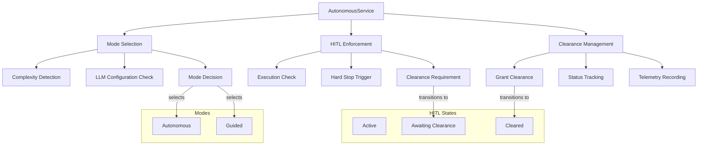

# How Autonomous/HITL Works

The AutonomousService manages the switch between Autonomous and Guided execution modes and enforces Human-in-the-Loop (HITL) clearance checkpoints. This guide explains how CCT balances AI autonomy with human oversight for mission-critical tasks.

## Overview

CCT's AutonomousService provides execution control through:
- **Autonomous Mode Selection**: LLM-powered automation for well-understood domains
- **Guided Mode Selection**: Human-in-the-loop for mission-critical tasks
- **HITL Enforcement**: Hard stops requiring human clearance
- **Clearance Management**: Granting and tracking human authorization
- **Complexity-Aware Routing**: Mode selection based on task complexity

**Key Features:**
- **Dual-Mode Operation**: Autonomous (LLM-powered) vs Guided (human-in-the-loop)
- **Complexity Detection**: Automatic mode selection based on task complexity
- **Hard Stop Protection**: HITL enforcement blocks execution until cleared
- **Clearance Tracking**: Audit trail of authorizations
- **Profile-Based Control**: Different behavior per CCT profile

## Architecture



## Core Components

### AutonomousService

**Location**: `src/core/services/orchestration/autonomous.py` (lines 19-174)

The `AutonomousService` provides unified execution control service managing both LLM autonomous mode and HITL enforcement.

**Key Responsibilities:**
- Determine execution mode (autonomous vs guided) based on complexity
- Check if execution is allowed for session
- Trigger human stops for HITL sessions
- Grant human clearance to blocked sessions
- Track HITL telemetry and status

### Autonomous Mode Selection

**Purpose**: Determine if AI should run autonomously based on task complexity

**Implementation:**
```python
def get_execution_mode(self, complexity: TaskComplexity) -> str:
    """
    Determines the mode based on settings and task complexity.
    Returns: 'autonomous' or 'guided'
    """
    # If no LLM configured, always guided
    if not self._has_llm_configured():
        return "guided"
    
    # Heuristic: Simple tasks are always guided to save context/tokens.
    # Sovereign tasks are always autonomous if possible for deep reasoning.
    if complexity == TaskComplexity.SIMPLE:
        return "guided"
        
    return "autonomous"
```

**LLM Configuration Check:**
```python
def _has_llm_configured(self) -> bool:
    """Checks if any valid LLM provider is configured in settings."""
    if self.settings.gemini_api_key:
        return True
    if self.settings.openai_api_key:
        return True
    if self.settings.anthropic_api_key:
        return True
    if self.settings.ollama_base_url and self.settings.llm_provider == "ollama":
        return True
    return False
```

**Mode Selection Logic:**
- **No LLM configured**: Always guided (no autonomous capability)
- **SIMPLE complexity**: Always guided (save context/tokens)
- **MODERATE/COMPLEX/SOVEREIGN**: Autonomous (requires deep reasoning)

### HITL Enforcement

**Purpose**: Check if tool execution is allowed for session

**Implementation:**
```python
def check_execution_allowed(self, session_id: str) -> Dict[str, Any]:
    """
    Check if tool execution is allowed for session.
    Called by orchestrator before executing any tool.
    """
    session = self.memory.get_session(session_id)
    if not session:
        return {"allowed": False, "error": "Session not found", "code": 404}
    
    # Not HITL profile - allow
    if session.profile != CCTProfile.HUMAN_IN_THE_LOOP:
        return {"allowed": True}
    
    # HITL profile - check if hard STOP is active
    if session.status == SessionStatus.AWAITING_HUMAN_CLEARANCE:
        summary = getattr(session, 'executive_summary', {})
        return {
            "allowed": False,
            "blocked_by": "HITL_ENFORCEMENT",
            "code": 403,
            "error": "🛑 EXECUTION BLOCKED: Human clearance required",
            "status": "awaiting_human_clearance",
            "executive_summary": summary,
            "instructions": "Call grant_human_clearance() to proceed"
        }
    
    return {"allowed": True}
```

**HITL Profile:**
- Only applies to sessions with `CCTProfile.HUMAN_IN_THE_LOOP`
- Other profiles (AUTONOMOUS, HITL_HARDENED) bypass HITL checks
- Provides hard stop protection for mission-critical sessions

### Human Stop Trigger

**Purpose**: Trigger a hard STOP for HITL sessions

**Implementation:**
```python
def trigger_human_stop(
    self, 
    session_id: str, 
    executive_summary: Dict[str, Any]
) -> Dict[str, Any]:
    """Triggers a hard STOP for HITL sessions."""
    session = self.memory.get_session(session_id)
    if not session or session.profile != CCTProfile.HUMAN_IN_THE_LOOP:
        return {"status": "not_applicable"}

    session.status = SessionStatus.AWAITING_HUMAN_CLEARANCE
    session.hitl_triggered_at = datetime.now(timezone.utc).isoformat()
    session.executive_summary = executive_summary
    self.memory.update_session(session)

    logger.warning(f"[AUTONOMOUS] HITL STOP triggered for session {session_id}")
    
    return {
        "status": "human_stop_triggered",
        "code": 403,
        "message": "🛑 HUMAN STOP: Execution paused awaiting clearance",
        "executive_summary": executive_summary,
        "clearance_required": True
    }
```

**Executive Summary:**
- Provides context for human reviewer
- Includes current state, reasoning, and recommendations
- Enables informed clearance decisions

### Clearance Management

**Purpose**: Grant human clearance to a blocked session

**Implementation:**
```python
def grant_clearance(
    self, 
    session_id: str, 
    authorized_by: str,
    note: str = ""
) -> Dict[str, Any]:
    """Grants human clearance to a blocked session."""
    session = self.memory.get_session(session_id)
    if not session or session.status != SessionStatus.AWAITING_HUMAN_CLEARANCE:
        return {"status": "error", "message": "Session not awaiting clearance"}

    session.status = SessionStatus.CLEARED
    session.cleared_at = datetime.now(timezone.utc).isoformat()
    session.authorized_by = authorized_by
    session.authorization_note = note
    self.memory.update_session(session)

    logger.info(f"[AUTONOMOUS] HITL CLEARANCE granted for {session_id} by {authorized_by}")
    return {"status": "cleared", "session_id": session_id}
```

**Clearance Tracking:**
- Records who authorized the clearance
- Records when clearance was granted
- Stores authorization notes for audit trail

### HITL Status Tracking

**Purpose**: Retrieve detailed HITL/Autonomous telemetry

**Implementation:**
```python
def get_hitl_status(self, session_id: str) -> Dict[str, Any]:
    """Retrieves detailed HITL/Autonomous telemetry."""
    session = self.memory.get_session(session_id)
    if not session: return {"status": "error"}
    
    is_hitl = session.profile == CCTProfile.HUMAN_IN_THE_LOOP
    return {
        "session_id": session_id,
        "profile": session.profile.value,
        "hitl_active": is_hitl and session.status == SessionStatus.AWAITING_HUMAN_CLEARANCE,
        "cleared": session.status == SessionStatus.CLEARED if is_hitl else None,
        "triggered_at": getattr(session, 'hitl_triggered_at', None),
        "authorized_by": getattr(session, 'authorized_by', None)
    }
```

**Telemetry Data:**
- Session profile (HUMAN_IN_THE_LOOP or other)
- HITL active status (awaiting clearance)
- Clearance status (cleared or not)
- Trigger timestamp
- Authorizer identity

### HITL Telemetry

**Purpose**: Get comprehensive HITL telemetry for a session

**Implementation:**
```python
def get_hitl_telemetry(self, session_id: str) -> Dict[str, Any]:
    """
    Gets HITL telemetry for a session.
    Returns telemetry including stops triggered and clearance status.
    """
    session = self.memory.get_session(session_id)
    if not session:
        return {"session_id": session_id, "error": "session_not_found"}

    return {
        "session_id": session_id,
        "profile": session.profile.value,
        "stops_triggered": 1 if session.hitl_triggered_at else 0,
        "cleared": session.status == SessionStatus.CLEARED,
        "triggered_at": session.hitl_triggered_at,
        "authorized_by": session.authorized_by,
        "cleared_at": session.cleared_at
    }
```

## Integration Points

**With CognitiveOrchestrator:**
```python
# Orchestrator checks execution allowed before tool execution
check = autonomous.check_execution_allowed(session_id)
if not check["allowed"]:
    return check  # Block execution

# Orchestrator determines execution mode
mode = autonomous.get_execution_mode(complexity)
if mode == "guided":
    # Use guidance instead of autonomous execution
    guidance_msg = guidance.format_guidance_message(strategy)
```

**With ComplexityService:**
```python
# AutonomousService uses complexity for mode selection
complexity = complexity_service.detect_complexity(problem_statement)
mode = autonomous.get_execution_mode(complexity)
```

**With MemoryManager:**
```python
# AutonomousService updates session state for HITL
session.status = SessionStatus.AWAITING_HUMAN_CLEARANCE
memory.update_session(session)
```

## Execution Flow

### Autonomous Mode Example

```python
# 1. Detect complexity
problem_statement = "Design a scalable payment processing system..."
complexity = complexity_service.detect_complexity(problem_statement)
# Returns: TaskComplexity.COMPLEX

# 2. Determine execution mode
mode = autonomous.get_execution_mode(complexity)
# Returns: "autonomous"

# 3. Execute autonomous reasoning
result = await engine.execute(session_id, input_payload)
# Full LLM-powered automation without human intervention
```

### HITL Mode Example

```python
# 1. Create HITL session
session = cognitive_orchestrator.create_session(
    problem_statement=problem_statement,
    profile=CCTProfile.HUMAN_IN_THE_LOOP
)

# 2. Trigger human stop at critical point
executive_summary = {
    "current_state": "Architecture proposal complete",
    "reasoning": "Proposed microservices architecture",
    "recommendation": "Proceed to implementation",
    "risks": ["Complexity increase", "Operational overhead"]
}
stop_result = autonomous.trigger_human_stop(session_id, executive_summary)
# Returns: {"status": "human_stop_triggered", "clearance_required": True}

# 3. Check execution allowed
check = autonomous.check_execution_allowed(session_id)
# Returns: {"allowed": False, "blocked_by": "HITL_ENFORCEMENT"}

# 4. Grant clearance
clearance_result = autonomous.grant_clearance(
    session_id=session_id,
    authorized_by="security_lead",
    note="Architecture approved with security review"
)
# Returns: {"status": "cleared", "session_id": session_id}

# 5. Resume execution
result = await engine.execute(session_id, input_payload)
# Execution proceeds after clearance
```

## CCT Profiles

### AUTONOMOUS Profile
- No HITL enforcement
- Full LLM-powered automation
- Best for well-understood domains

### HUMAN_IN_THE_LOOP Profile
- HITL enforcement enabled
- Human clearance required for critical operations
- Best for mission-critical tasks

### HITL_HARDENED Profile
- Strict HITL enforcement
- Additional security measures
- Best for sovereign/production tasks

## Performance Characteristics

**Autonomous Mode:**
- Full LLM-powered automation
- No human intervention required
- Fast execution for well-understood tasks

**Guided Mode:**
- Human-in-the-loop oversight
- Structured guidance instead of execution
- Best for mission-critical scenarios

**HITL Enforcement:**
- Hard stops prevent unauthorized execution
- Executive summary provides context
- Audit trail for compliance

## Code References

- **AutonomousService**: `src/core/services/orchestration/autonomous.py` (lines 19-174)
- **ComplexityService**: `src/core/services/analysis/complexity.py` (lines 6-47)
- **SessionStatus Enum**: `src/core/models/enums.py`
- **CCTProfile Enum**: `src/core/models/enums.py`

## Whitepaper Reference

This documentation expands on **Section 3: The Brain's Advisor** of the main whitepaper, providing technical implementation details for the HITL and autonomous execution concepts described there.

---

*See Also:*
- [How Routing Works](./how-routing-works.md)
- [How Guidance Works](./how-guidance-works.md)
- [How Hybrid Thinking Engine Works](./how-hybrid-thinking-engine-works.md)
- [Main Whitepaper](../whitepaper.md)
