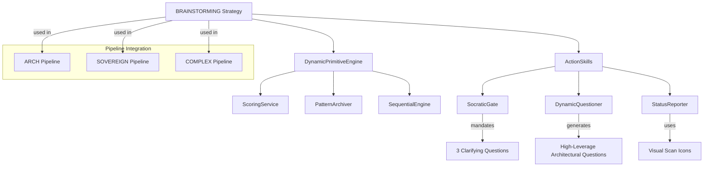

# How Brainstorming Works

The Brainstorming thinking strategy enables CCT to generate diverse ideas, explore alternative approaches, and break through cognitive deadlocks. This guide explains how the BRAINSTORMING strategy works within CCT's cognitive framework.

## Overview

CCT's Brainstorming strategy is a primitive cognitive mode that facilitates:
- **Idea Generation**: Rapid generation of diverse alternatives
- **Lateral Thinking**: Exploration of unconventional approaches
- **Question Generation**: High-leverage architectural questioning
- **Deadlock Breaking**: Provocative shifts to break cognitive stagnation

**Key Features:**
- **Dynamic Primitive**: Handled by DynamicPrimitiveEngine
- **Skill-Enhanced**: Integrated with ActionSkills for specialized behaviors
- **Pipeline Integration**: Used in ARCH and SOVEREIGN pipelines
- **Socratic Gating**: Mandates clarifying questions for complex tasks
- **Status Reporting**: Visual scan icons for mission transparency

## Architecture



## Core Components

### BRAINSTORMING Strategy

**Location**: `src/core/models/enums.py` (line 47)

```python
class ThinkingStrategy(str, Enum):
    BRAINSTORMING = "brainstorming"
```

The BRAINSTORMING strategy is a primitive thinking mode that enables divergent idea generation and exploration.

### DynamicPrimitiveEngine Integration

**Location**: `src/modes/primitives/orchestrator.py` (lines 20-141)

The BRAINSTORMING strategy is handled by the DynamicPrimitiveEngine, which processes all primitive cognitive strategies through a unified factory pattern.

**4-Stage Processing:**
1. **Contextual Injection**: Retrieves state from SequentialEngine
2. **Hardened Validation**: Scores thought with 4-vector metrics
3. **Cognitive Evolution**: Archives elite thoughts as patterns
4. **Early Convergence**: Detects breakthrough thoughts

### ActionSkills Integration

**Location**: `src/core/services/loader/skills.py` (lines 70-74)

The BRAINSTORMING strategy has associated ActionSkills that enhance its behavior:

```python
ThinkingStrategy.BRAINSTORMING: [
    ActionSkill("SocraticGate", "Mandating 3 clarifying questions for vague or complex tasks.", []),
    ActionSkill("DynamicQuestioner", "Generating high-leverage architectural questions vs static templates.", []),
    ActionSkill("StatusReporter", "Using visual scan icons (✅🔄⏳❌) for mission transparency.", [])
]
```

**Skill Descriptions:**

**SocraticGate:**
- Mandates 3 clarifying questions for vague or complex tasks
- Ensures problem understanding before solution generation
- Prevents premature solution attempts on ill-defined problems

**DynamicQuestioner:**
- Generates high-leverage architectural questions vs static templates
- Adapts questioning to context rather than using generic templates
- Focuses on questions that drive architectural insight

**StatusReporter:**
- Uses visual scan icons (✅🔄⏳❌) for mission transparency
- Provides clear visual feedback on brainstorming progress
- Enhances human understanding of cognitive state

## Pipeline Integration

The BRAINSTORMING strategy is integrated into multiple policy pipelines:

### ARCH Pipeline

**Location**: `src/core/services/orchestration/policy.py` (lines 66-71)

```python
"ARCH": [
    ThinkingStrategy.BRAINSTORMING,
    ThinkingStrategy.ENGINEERING_DECONSTRUCTION,
    ThinkingStrategy.FIRST_PRINCIPLES,
    ThinkingStrategy.SYSTEMIC,
    ThinkingStrategy.COUNCIL_OF_CRITICS,
    # ...
]
```

**Purpose in ARCH Pipeline:**
- Initial idea generation for architectural challenges
- Divergent exploration before convergent refinement
- Breaking down complex architectural problems

### SOVEREIGN Pipeline

**Location**: `src/core/services/orchestration/policy.py` (lines 102-106)

```python
"SOVEREIGN": [
    ThinkingStrategy.BRAINSTORMING,
    ThinkingStrategy.ENGINEERING_DECONSTRUCTION,
    ThinkingStrategy.SYSTEMIC,
    ThinkingStrategy.DEDUCTIVE_VALIDATION,
    ThinkingStrategy.POST_MISSION_LEARNING
]
```

**Purpose in SOVEREIGN Pipeline:**
- Mission-critical idea generation
- High-stakes scenario exploration
- Comprehensive problem space mapping

### COMPLEX Pipeline

**Location**: `src/core/services/orchestration/policy.py` (lines 77-81)

```python
"COMPLEX": [
    ThinkingStrategy.BRAINSTORMING,
    ThinkingStrategy.ENGINEERING_DECONSTRUCTION,
    ThinkingStrategy.SYSTEMATIC,
    ThinkingStrategy.ACTOR_CRITIC_LOOP,
    ThinkingStrategy.POST_MISSION_LEARNING
]
```

**Purpose in COMPLEX Pipeline:**
- Complex task decomposition
- Multi-faceted exploration
- Systematic idea generation

## Brainstorming Process

### 1. Problem Clarification (SocraticGate)

**Purpose**: Ensure problem understanding before ideation

```python
# SocraticGate mandates 3 clarifying questions
clarifying_questions = [
    "What is the core architectural constraint?",
    "What are the success criteria for this solution?",
    "What are the potential failure modes?"
]
```

**Benefits:**
- Prevents solving the wrong problem
- Establishes clear success criteria
- Identifies potential pitfalls early

### 2. Question Generation (DynamicQuestioner)

**Purpose**: Generate high-leverage architectural questions

```python
# DynamicQuestioner generates context-aware questions
architectural_questions = [
    "How does this decision affect system scalability?",
    "What are the trade-offs between performance and maintainability?",
    "How does this align with existing architectural principles?"
]
```

**Benefits:**
- Context-specific questioning
- Architectural focus
- Trade-off awareness

### 3. Idea Generation

**Purpose**: Generate diverse alternative approaches

**Brainstorming Techniques:**
- **Divergent Generation**: Multiple parallel ideas
- **Lateral Thinking**: Unconventional approaches
- **Morphological Analysis**: Combining different attributes
- **SCAMPER**: Substitute, Combine, Adapt, Modify, Put to other uses, Eliminate, Reverse

### 4. Status Reporting (StatusReporter)

**Purpose**: Visual transparency of brainstorming progress

```python
# StatusReporter uses visual icons
status_icons = {
    "completed": "✅",
    "in_progress": "🔄",
    "pending": "⏳",
    "blocked": "❌"
}
```

**Benefits:**
- Quick visual scan
- Progress tracking
- Human-readable feedback

## Integration Points

**With DynamicPrimitiveEngine:**
```python
# Brainstorming is handled as a primitive strategy
primitive_engine = DynamicPrimitiveEngine(
    memory_manager=memory_manager,
    sequential_engine=sequential_engine,
    identity_service=identity_service,
    scoring_engine=scoring_engine,
    strategy=ThinkingStrategy.BRAINSTORMING
)
```

**With PolicyService:**
```python
# PolicyService selects BRAINSTORMING for appropriate pipelines
pipeline = policy.get_pipeline("ARCH")
# Returns: [BRAINSTORMING, ENGINEERING_DECONSTRUCTION, ...]
```

**With SkillsLoader:**
```python
# SkillsLoader loads associated ActionSkills
skills = skills_loader.get_skills(ThinkingStrategy.BRAINSTORMING)
# Returns: [SocraticGate, DynamicQuestioner, StatusReporter]
```

## Execution Flow

### Brainstorming Session Example

```python
# Input payload
input_payload = {
    "thought_number": 1,
    "estimated_total_thoughts": 5,
    "next_thought_needed": True,
    "thought_content": "Let's brainstorm alternative architectures for the payment service...",
    "thought_type": "observation",
    "is_revision": False
}

# Execute brainstorming
result = await primitive_engine.execute(
    session_id="session_abc123",
    input_payload=input_payload
)

# Returns:
# {
#     "status": "success",
#     "orchestration_mode": "brainstorming",
#     "generated_thought_id": "bra_143052_abc123",
#     "is_thinking_pattern": False,
#     "early_convergence_suggested": False,
#     "current_step": 1,
#     "estimated_total": 5,
#     "metrics": {
#         "clarity": 0.82,
#         "coherence": 0.88,
#         "novelty": 0.95,  # High novelty for brainstorming
#         "evidence": 0.75
#     }
# }
```

## Performance Characteristics

**Novelty Emphasis:**
- Brainstorming prioritizes high novelty scores
- Encourages divergent thinking
- Values unconventional approaches

**Quality Assurance:**
- 4-vector metrics validate brainstorming output
- Scoring ensures clarity and coherence
- Evidence strength prevents baseless speculation

**Token Efficiency:**
- 4000 token budget for analysis
- Caching prevents redundant calculations
- Early convergence when solution found

## Code References

- **ThinkingStrategy Enum**: `src/core/models/enums.py` (line 47)
- **DynamicPrimitiveEngine**: `src/modes/primitives/orchestrator.py` (lines 20-141)
- **SkillsLoader**: `src/core/services/loader/skills.py` (lines 70-74)
- **PolicyService**: `src/core/services/orchestration/policy.py` (lines 66-106)

## Whitepaper Reference

This documentation expands on **Section 2.A: The Atomic Workers: Primitives** of the main whitepaper, providing technical implementation details for the BRAINSTORMING strategy described there.

---

*See Also:*
- [How Primitives Thinking Engine Works](./how-primitives-thinking-engine-works.md)
- [How Hybrid Thinking Engine Works](./how-hybrid-thinking-engine-works.md)
- [How Analysis Works](./how-analysis-works.md)
- [Main Whitepaper](../whitepaper.md)
