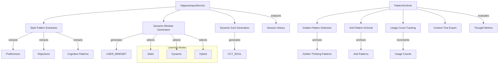

# How Continuous Learning Works

CCT's continuous learning system enables the AI to adapt and improve over time through two complementary mechanisms: the Digital Hippocampus (Strategic Human Assistance) and Long-Term Potentiation (Pattern Archiving). This guide explains how CCT learns from user interactions and its own elite reasoning patterns.

## Overview

CCT implements continuous learning through:
- **Digital Hippocampus**: Learns user's architectural style from interactions
- **Pattern Archiver**: Archives elite thoughts as reusable Golden Thinking Patterns
- **Anti-Pattern System**: Remembers failures to prevent repetition
- **Dynamic Identity Generation**: Auto-builds mindset/soul prompts based on learning
- **Context Tree Export**: Human-readable pattern documentation

**Key Features:**
- **Strategic Human Assistance**: AI becomes a cognitive partner that understands the user
- **Long-Term Potentiation (LTP)**: Patterns strengthen with use
- **Cognitive Immune System**: Anti-patterns prevent repeated failures
- **Hybrid Identity Mode**: Combines static and dynamic learning
- **Automatic Pattern Export**: Archives to Context Tree for human review

## Architecture



## Core Components

### HippocampusService

**Location**: `src/core/services/learning/hippocampus.py` (lines 50-427)

The `HippocampusService` implements Strategic Human Assistance by learning the user's architectural style from interactions.

**Learning Mechanism:**
```python
def analyze_session(self, session_id: str) -> LearnedIdentity:
    """
    Analyze a session to extract architectural style patterns.
    
    Extracts:
    - User preferences (patterns they approve)
    - User rejections (patterns they criticize)
    - Architectural patterns (repeated structures)
    """
    session = self.memory.get_session(session_id)
    history = self.memory.get_session_history(session_id)
    
    # Analyze thoughts for patterns
    for thought in history:
        self._analyze_thought(thought)
    
    self.learned_identity.interaction_count += len(history)
    self.learned_identity.last_updated = datetime.now(timezone.utc)
    
    # Save learned patterns
    self._save_learned_identity()
    
    return self.learned_identity
```

**Pattern Extraction:**
```python
def _analyze_thought(self, thought: EnhancedThought) -> None:
    content_lower = thought.content.lower()
    
    # Detect architectural preferences
    preference_keywords = {
        'ddd': 'Domain-Driven Design',
        'clean architecture': 'Clean Architecture',
        'solid': 'SOLID principles',
        'microservice': 'Microservices',
        'event-driven': 'Event-driven architecture',
        # ...
    }
    
    for keyword, preference in preference_keywords.items():
        if keyword in content_lower:
            self._add_pattern('preference', preference, thought.content)
    
    # Detect architectural rejections (anti-patterns)
    rejection_keywords = {
        'spaghetti': 'Spaghetti code',
        'god object': 'God Object anti-pattern',
        'tight coupling': 'Tight coupling',
        # ...
    }
    
    for keyword, rejection in rejection_keywords.items():
        if keyword in content_lower:
            self._add_pattern('rejection', rejection, thought.content)
```

**Pattern Strengthening:**
```python
def _add_pattern(self, pattern_type: str, description: str, example: str) -> None:
    """Add or update a pattern in the learned identity."""
    pattern_id = f"{pattern_type}_{hash(description)}"
    
    for pattern in patterns:
        if pattern.pattern_id == pattern_id:
            # Update existing pattern
            pattern.observation_count += 1
            pattern.confidence = min(1.0, pattern.confidence + 0.1)
            pattern.last_observed = datetime.now(timezone.utc)
            if example not in pattern.examples:
                pattern.examples.append(example[:200])
            return
    
    # Add new pattern
    new_pattern = StylePattern(
        pattern_id=pattern_id,
        pattern_type=pattern_type,
        description=description,
        examples=[example[:200]],
        confidence=0.5,
        observation_count=1
    )
    patterns.append(new_pattern)
```

**Dynamic Mindset Generation:**
```python
def generate_dynamic_mindset(self) -> str:
    """
    Generate a dynamic USER_MINDSET based on learned patterns.
    
    Provides auto-build prompt capability when static configs use defaults.
    """
    if not self.learned_identity.learned_preferences:
        return None  # Use static default
    
    mindset_lines = ["# 🧠 LEARNED USER_MINDSET: Dynamic Architectural DNA\n"]
    mindset_lines.append("## Learned Architectural Preferences\n")
    
    # Group preferences by confidence
    high_confidence = [p for p in self.learned_identity.learned_preferences if p.confidence >= 0.7]
    medium_confidence = [p for p in self.learned_identity.learned_preferences if 0.5 <= p.confidence < 0.7]
    
    if high_confidence:
        mindset_lines.append("### Strong Preferences (High Confidence)")
        for pattern in high_confidence:
            mindset_lines.append(f"- **{pattern.description}** (confidence: {pattern.confidence:.2f})")
    
    # Add learned rejections
    if self.learned_identity.learned_rejections:
        mindset_lines.append("\n## Architectural Rejections (Anti-Patterns)")
        for pattern in self.learned_identity.learned_rejections:
            mindset_lines.append(f"- 🚫 **{pattern.description}** (confidence: {pattern.confidence:.2f})")
    
    return "\n".join(mindset_lines)
```

**Dynamic Soul Generation:**
```python
def generate_dynamic_soul(self) -> str:
    """
    Generate a dynamic CCT_SOUL based on learned patterns.
    
    Provides auto-build prompt capability for the digital twin persona.
    """
    soul_lines = ["# 🧬 LEARNED CCT_SOUL: Dynamic Digital Twin Persona\n"]
    soul_lines.append("## Learned Interaction Style\n")
    
    # Analyze patterns to determine interaction style
    critical_count = len([p for p in self.learned_identity.learned_patterns if 'critical' in p.description.lower()])
    synthesis_count = len([p for p in self.learned_identity.learned_patterns if 'synthesis' in p.description.lower()])
    
    if critical_count > synthesis_count:
        soul_lines.append("### Critical Thinking Style")
        soul_lines.append("You adopt a highly critical, analytical approach.")
    elif synthesis_count > critical_count:
        soul_lines.append("### Integrative Thinking Style")
        soul_lines.append("You excel at synthesizing multiple perspectives.")
    else:
        soul_lines.append("### Balanced Thinking Style")
        soul_lines.append("You balance critical analysis with integrative synthesis.")
    
    return "\n".join(soul_lines)
```

**Identity Mode Selection:**
```python
def get_enhanced_identity(self) -> Dict[str, str]:
    """
    Get enhanced identity with learned patterns.
    
    Returns:
        Dict with 'user_mindset' and 'cct_soul', either:
        - Dynamic (if enough learning data)
        - Static (fallback to defaults)
        - Hybrid (static + dynamic enhancements)
    """
    static_identity = self.identity.load_identity()
    dynamic_mindset = self.generate_dynamic_mindset()
    dynamic_soul = self.generate_dynamic_soul()
    
    if dynamic_mindset and dynamic_soul:
        if self.learned_identity.interaction_count >= 10:
            # Use fully dynamic identity
            return {
                'user_mindset': dynamic_mindset,
                'cct_soul': dynamic_soul,
                'source': 'dynamic'
            }
        else:
            # Use hybrid (static + dynamic)
            hybrid_mindset = f"{static_identity.get('user_mindset', '')}\n\n{dynamic_mindset}"
            hybrid_soul = f"{static_identity.get('cct_soul', '')}\n\n{dynamic_soul}"
            return {
                'user_mindset': hybrid_mindset,
                'cct_soul': hybrid_soul,
                'source': 'hybrid'
            }
    else:
        # Use static
        return {
            'user_mindset': static_identity.get('user_mindset'),
            'cct_soul': static_identity.get('cct_soul'),
            'source': 'static'
        }
```

### PatternArchiver

**Location**: `src/engines/memory/thinking_patterns.py` (lines 38-366)

The `PatternArchiver` implements Long-Term Potentiation (LTP) by archiving elite thoughts as Golden Thinking Patterns.

**Golden Pattern Detection:**
```python
def is_golden_pattern_candidate(self, thought: EnhancedThought) -> bool:
    """
    Check if thought qualifies as Golden Thinking Pattern.
    
    Criteria (from CCT v5.0):
    - logical_coherence >= 0.9
    - evidence_strength >= 0.8
    """
    if not thought.metrics:
        return False
    
    metrics = thought.metrics
    return (
        metrics.logical_coherence >= self.tp_threshold and
        metrics.evidence_strength >= self.evidence_threshold
    )
```

**Pattern Archival:**
```python
def archive_thought(self, thought: EnhancedThought, session_id: str) -> ArchiveResult:
    """
    Archive a thought as Golden Thinking Pattern if it qualifies.
    Also exports to Context Tree markdown.
    """
    # Check if already archived
    existing = self._check_existing_pattern(thought)
    if existing:
        # Increment usage count for existing pattern
        self._increment_usage_count(existing.id)
        return ArchiveResult(
            archived=False,
            pattern_id=existing.id,
            pattern_type="golden_existing",
            reason="Pattern already archived, usage count incremented"
        )
    
    # Check if qualifies as golden pattern
    if not self.is_golden_pattern_candidate(thought):
        return ArchiveResult(
            archived=False,
            pattern_type="none",
            reason=f"Does not meet thresholds"
        )
    
    # Create Golden Thinking Pattern
    pattern = GoldenThinkingPattern(
        id=f"gtp_{uuid.uuid4().hex[:8]}",
        thought_id=thought.id,
        session_id=session_id,
        strategy=thought.strategy,
        content_summary=thought.summary or thought.content[:200],
        full_content=thought.content,
        metrics=thought.metrics,
        tags=thought.tags,
        created_at=datetime.now(timezone.utc).isoformat(),
        usage_count=1
    )
    
    # Persist to memory
    self.memory.save_thinking_pattern(pattern)
    self._stats["golden_archived"] += 1
    thought.is_thinking_pattern = True
    
    # Export to Context Tree (Markdown)
    self._export_to_markdown(pattern, thought.strategy.value)
    
    return ArchiveResult(
        archived=True,
        pattern_id=pattern.id,
        pattern_type="golden",
        reason="Elite thought archived as Golden Thinking Pattern"
    )
```

**Anti-Pattern Archival:**
```python
def archive_anti_pattern(
    self,
    thought: EnhancedThought,
    session_id: str,
    failure_reason: str,
    corrective_action: str,
    category: str = "unknown"
) -> ArchiveResult:
    """
    Archive a failure as Anti-Pattern for cognitive immune system.
    
    Anti-patterns prevent the AI from "falling into the same pit twice"
    by remembering failures and their corrections.
    """
    anti_pattern = AntiPattern(
        id=f"anti_{uuid.uuid4().hex[:8]}",
        thought_id=thought.id,
        session_id=session_id,
        failed_strategy=thought.strategy,
        problem_context=thought.content[:200],
        category=category,
        failure_reason=failure_reason,
        corrective_action=corrective_action,
        created_at=datetime.now(timezone.utc).isoformat()
    )
    
    self.memory.save_anti_pattern(anti_pattern)
    self._stats["anti_archived"] += 1
    
    return ArchiveResult(
        archived=True,
        pattern_id=anti_pattern.id,
        pattern_type="anti",
        reason="Failure archived as Anti-Pattern for immune system"
    )
```

**Usage Count Tracking (LTP Effect):**
```python
def _increment_usage_count(self, pattern_id: str) -> None:
    """
    Increment the usage count of a pattern (LTP effect).
    
    Frequently used neural pathways become stronger over time.
    """
    pattern = self.memory.get_thinking_pattern_by_id(pattern_id)
    old_count = pattern.usage_count if pattern else 0
    self.memory.increment_pattern_usage(pattern_id)
    new_count = old_count + 1
    
    logger.info(
        f"[ARCHIVER] Pattern usage incremented (LTP effect) | "
        f"pattern_id={pattern_id} | "
        f"usage_count={old_count}->{new_count}"
    )
```

**Pattern Retrieval:**
```python
def get_top_patterns(self, n: int = 5) -> List[GoldenThinkingPattern]:
    """
    Retrieve top N most used golden patterns.
    
    These are the strongest neural pathways - patterns that have
    been validated and reused multiple times.
    """
    patterns = self.memory.get_thinking_patterns_by_usage(limit=n)
    self._stats["retrievals"] += 1
    return patterns
```

**Context Tree Export:**
```python
def _export_to_markdown(self, pattern: GoldenThinkingPattern, strategy_name: str):
    """Converts the pattern into a standardized Context Tree Markdown file."""
    topic = strategy_name.replace("_", "-").title()
    topic_dir = os.path.join(self.docs_root, topic)
    os.makedirs(topic_dir, exist_ok=True)
    
    file_path = os.path.join(topic_dir, f"{pattern.id}.md")
    
    md_content = f"""---
title: "{pattern.content_summary[:100]}..."
tags: {pattern.tags}
tp_id: "{pattern.id}"
thought_id: "{pattern.thought_id}"
logic_score: {pattern.metrics.logical_coherence}
evidence_score: {pattern.metrics.evidence_strength}
---

# Golden Thinking Pattern: {pattern.id}

## Problem Context
> {pattern.full_content[:200]}...

## Cognitive Strategy: {topic}
{pattern.full_content}

## Metadata
- **Archived At:** {pattern.created_at}
- **Usage Count:** {pattern.usage_count}
"""
    with open(file_path, "w", encoding="utf-8") as f:
        f.write(md_content)
```

## Learning Modes

### Static Mode
- Uses pre-configured identity files
- No learning applied
- Fallback when no interaction data available

### Dynamic Mode
- Fully learned identity from interactions
- Requires 10+ interactions to activate
- Auto-generated mindset and soul prompts

### Hybrid Mode
- Combines static configuration with learned patterns
- Used when learning data is present but insufficient for full dynamic mode
- Best of both worlds: base configuration + learned enhancements

## Long-Term Potentiation (LTP)

**Biological Inspiration:**
- Neural pathways strengthen with repeated use
- Frequently accessed patterns become faster and more reliable
- Implements the "fire together, wire together" principle

**Implementation:**
```python
# Each pattern reuse increments usage count
pattern.usage_count += 1

# Retrieval ranked by usage count (strongest pathways first)
patterns = memory.get_thinking_patterns_by_usage(limit=n)
```

**Benefits:**
- Elite patterns surface first in retrieval
- Quality patterns become more accessible
- Adaptive learning from successful reasoning

## Cognitive Immune System

**Anti-Pattern Purpose:**
- Prevent repeated failures
- Remember what doesn't work
- Provide corrective guidance for future attempts

**Anti-Pattern Structure:**
```python
AntiPattern(
    id="anti_abc123",
    thought_id="thought_xyz",
    session_id="session_789",
    failed_strategy="first_principles",
    problem_context="Attempted to deconstruct...",
    category="reasoning_error",
    failure_reason="Assumption was invalid",
    corrective_action="Verify assumptions with data first"
)
```

**Usage:**
- Archived when a thought leads to failure
- Retrieved when similar patterns detected
- Provides warnings and corrective actions

## Integration Points

**With DynamicPrimitiveEngine:**
```python
# Primitive engine archives elite patterns automatically
pattern = archiver.process_thought(session, thought)
```

**With CognitiveOrchestrator:**
```python
# Orchestrator uses enhanced identity
identity = hippocampus.get_enhanced_identity()
session.identity_layer = identity
```

**With MemoryManager:**
```python
# Pattern archiver persists to memory
memory.save_thinking_pattern(pattern)
memory.save_anti_pattern(anti_pattern)
```

**With IdentityService:**
```python
# Hippocampus enhances static identity
static_identity = identity.load_identity()
enhanced_identity = hippocampus.get_enhanced_identity()
```

## Performance Characteristics

**Learning Efficiency:**
- O(1) pattern update per interaction
- Incremental confidence building
- Persistent learning across sessions

**Retrieval Efficiency:**
- Usage-based ranking for fast access
- Similarity search for pattern matching
- LRU cache for tokenization

**Storage Efficiency:**
- JSON persistence for learned identity
- SQLite for pattern storage
- Markdown export for human readability

## Code References

- **HippocampusService**: `src/core/services/learning/hippocampus.py` (lines 50-427)
- **PatternArchiver**: `src/engines/memory/thinking_patterns.py` (lines 38-366)
- **StylePattern**: `src/core/services/learning/hippocampus.py` (lines 28-38)
- **LearnedIdentity**: `src/core/services/learning/hippocampus.py` (lines 40-48)
- **GoldenThinkingPattern**: `src/core/models/domain.py`

## Whitepaper Reference

This documentation expands on **Section 5: The Digital Hippocampus** and **Section 5.C: Long-Term Potentiation** of the main whitepaper, providing technical implementation details for the concepts described there.

---

*See Also:*
- [How Memory Works](./how-memory-works.md)
- [How Primitives Thinking Engine Works](./how-primitives-thinking-engine-works.md)
- [How Analysis Works](./how-analysis-works.md)
- [Main Whitepaper](../whitepaper.md)
