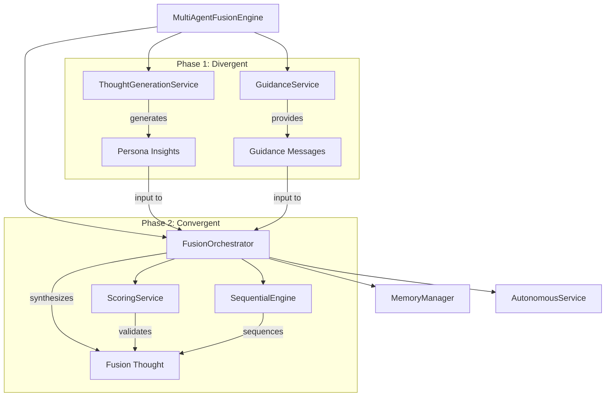

# How Fusion Thinking Engine Works

The Fusion Thinking Engine provides convergent cognitive synthesis, extracting insights from multiple divergent thoughts and merging them into unified conclusions. This guide explains how the `FusionOrchestrator` and `MultiAgentFusionEngine` work together to enable multi-perspective reasoning.

## Overview

CCT's fusion engine implements a two-phase cognitive process:
- **Divergent Phase**: Generate multiple perspectives (e.g., persona insights)
- **Convergent Phase**: Synthesize perspectives into a unified conclusion

**Key Features:**
- **Multi-Perspective Synthesis**: Combines diverse expert insights
- **Token-Efficient Fusion**: Uses efficiency tier for cost optimization
- **Identity Decoration**: Applies user's architectural DNA to synthesis
- **Convergence Detection**: Identifies when thinking paths have converged
- **Modular Design**: Reusable "Lego" principle across hybrid modes

## Architecture



## Core Components

### FusionOrchestrator

**Location**: `src/engines/fusion/orchestrator.py` (lines 21-174)

The `FusionOrchestrator` is the core convergent synthesis service that merges multiple thoughts into one unified conclusion.

**Key Responsibilities:**
- Retrieve and validate input thoughts
- Construct convergent context from divergent thoughts
- Execute synthesis in autonomous or guided mode
- Apply identity decoration to synthesis prompts
- Validate fusion quality with scoring

### MultiAgentFusionEngine

**Location**: `src/modes/hybrids/multiagents/orchestrator.py` (lines 21-163)

The `MultiAgentFusionEngine` simulates a multi-agent council using the Fusion Orchestrator.

**Key Responsibilities:**
- Execute divergent persona generation phase
- Coordinate convergent fusion phase
- Manage branching for persona insights
- Return comprehensive fusion results

## Two-Phase Fusion Process

### Phase 1: Divergent Perspectives (Persona Insights)

**Purpose**: Generate diverse expert insights from different perspectives

**Autonomous Mode:**
```python
for persona in validated_input.personas:
    # Create branch for each persona
    seq_context = sequential.process_sequence_step(
        session_id=session_id,
        llm_thought_number=thought_number,
        branch_from_id=target_thought.id,
        branch_id=f"persona_{persona.lower().replace(' ', '_')}"
    )
    
    # Generate persona insight
    prompt = (
        f"CONTEXT: {target_thought.content}\n"
        f"PERSONA: {persona}\n"
        f"INSTRUCTION: Provide a deep technical analysis from your specific expertise."
    )
    content = await thought_service.generate_thought(
        prompt=prompt,
        system_prompt=f"You are a {persona} expert participating in a cognitive war room."
    )
    
    # Save persona thought
    persona_thought = EnhancedThought(
        id=generate_thought_id("persona"),
        content=content,
        thought_type=ThoughtType.ANALYSIS,
        strategy=ThinkingStrategy.CRITICAL,
        parent_id=target_thought.id,
        tags=["multi_agent_fusion", "persona_insight", persona.lower()]
    )
    memory.save_thought(session_id, persona_thought)
    persona_nodes.append(persona_thought)
```

**Guided Mode:**
```python
# In guided mode, provide guidance instead of generating personas
guidance_msg = guidance.format_guidance_message(ThinkingStrategy.MULTI_AGENT_FUSION)
guidance_msg += f"\nSUGGESTED PERSONAS: {', '.join(validated_input.personas)}"

guidance_thought = EnhancedThought(
    id=generate_thought_id("guidance"),
    content=guidance_msg,
    thought_type=ThoughtType.PROTOCOL,
    strategy=ThinkingStrategy.MULTI_AGENT_FUSION,
    parent_id=target_thought.id,
    tags=["multi_agent_fusion", "guidance", "guided"]
)
```

**Branching Structure:**
- Each persona creates a branch from the target thought
- Branches enable parallel exploration without sequence conflicts
- All persona thoughts are children of the target thought

### Phase 2: Convergent Synthesis (The Fusion)

**Purpose**: Synthesize multiple divergent thoughts into one unified conclusion

**Context Construction:**
```python
source_context = "\n\n".join([
    f"--- Thought {t.id} ({t.strategy.value}) ---\n{t.content}" 
    for t in thoughts
])

fusion_prompt = (
    f"GOAL: {synthesis_goal}\n"
    f"Tier: {model_tier}\n"
    f"CONSTITUENT THOUGHTS:\n{source_context}\n\n"
    "INSTRUCTION: Synthesize the above perspectives into a single cohesive conclusion. "
    "Remove redundancies, resolve contradictions, and identify common patterns."
)
```

**Mode Determination:**
```python
mode = autonomous.get_execution_mode(session.complexity)

if mode == "autonomous":
    # Execute autonomous synthesis
    fusion_sys_prompt = "You are the CCT Fusion Engine. Synthesize the provided thoughts into a unified conclusion."
    fusion_content = await thought_service.generate_thought(
        prompt=fusion_prompt,
        system_prompt=get_identity_decorated_system_prompt(session_id, fusion_sys_prompt)
    )
    thought_type = ThoughtType.SYNTHESIS
else:
    # Provide guidance for manual synthesis
    fusion_content = guidance.format_guidance_message(ThinkingStrategy.INTEGRATIVE)
    thought_type = ThoughtType.PROTOCOL
```

**Identity Decoration:**
```python
def _get_identity_decorated_system_prompt(self, session_id: str, base_system_prompt: str) -> str:
    """Helper to decorate prompts with identity context."""
    session = memory.get_session(session_id)
    if not session or not session.identity_layer:
        identity = identity.load_identity()
    else:
        identity = session.identity_layer
        
    prefix = identity.format_system_prefix(identity)
    return f"{prefix}\n\n{base_system_prompt}"
```

**Fusion Thought Creation:**
```python
fusion_thought = EnhancedThought(
    id=f"fusion_{uuid.uuid4().hex[:8]}",
    content=fusion_content,
    thought_type=thought_type,
    strategy=ThinkingStrategy.INTEGRATIVE,
    parent_id=thought_ids[-1],
    builds_on=thought_ids,  # Links to all input thoughts
    sequential_context=seq_context,
    tags=["fusion", "synthesis", model_tier, mode]
)
```

**Quality Validation:**
```python
from src.core.constants import MAX_ANALYSIS_TOKEN_BUDGET

metrics = scoring.analyze_thought(
    fusion_thought, 
    thoughts,  # Context for comparison
    token_budget=MAX_ANALYSIS_TOKEN_BUDGET,  # 4000 token limit
    model_id=model_id
)
fusion_thought.metrics = metrics
```

## Convergence Detection

The `FusionOrchestrator` includes convergence detection to determine if thinking paths have converged:

```python
def check_convergence(self, session_id: str, threshold: float = 0.85) -> bool:
    """
    Determines if the session's thinking path has converged sufficiently.
    """
    history = memory.get_session_history(session_id)
    if len(history) < 2:
        return False
        
    # Analysis based on recent thoughts scoring
    recent = history[-3:]
    avg_coherence = sum(t.metrics.logical_coherence for t in recent) / len(recent)
    
    return avg_coherence >= threshold
```

**Convergence Criteria:**
- Minimum 2 thoughts in history
- Average logical coherence of recent 3 thoughts >= 0.85
- Indicates stable, high-quality reasoning path

## Model Tier Selection

**Efficiency Tier (Default):**
```python
model_tier="efficiency"  # Cheap/fast for fusion synthesis
```

Fusion uses the efficiency tier by default to optimize costs while maintaining quality through:
- Convergent synthesis (reduces complexity)
- Context-rich input (reduces need for expensive models)
- Quality validation (ensures standards are met)

## Integration Points

**With MultiAgentFusionEngine:**
```python
# MultiAgentFusionEngine uses FusionOrchestrator for convergence
fusion_thought = fusion.fuse_thoughts(
    session_id=session_id,
    thought_ids=[n.id for n in persona_nodes],
    synthesis_goal=synthesis_goal,
    model_id=session.model_id,
    model_tier="efficiency"
)
```

**With AutonomousService:**
```python
# Determines execution mode (autonomous vs guided)
mode = autonomous.get_execution_mode(session.complexity)
```

**With ThoughtGenerationService:**
```python
# Generates synthesis in autonomous mode
fusion_content = await thought_service.generate_thought(
    prompt=fusion_prompt,
    system_prompt=decorated_system_prompt
)
```

**With GuidanceService:**
```python
# Provides guidance in guided mode
fusion_content = guidance.format_guidance_message(ThinkingStrategy.INTEGRATIVE)
```

**With IdentityService:**
```python
# Decorates prompts with user's architectural DNA
decorated_prompt = get_identity_decorated_system_prompt(session_id, base_prompt)
```

## Execution Flow

### Complete Multi-Agent Fusion Example

```python
# Input payload from MCP tool
input_payload = {
    "target_thought_id": "thought_abc123",
    "personas": ["Security Architect", "Database Expert", "Frontend Engineer"]
}

# Execute multi-agent fusion
result = await multi_agent_fusion_engine.execute(
    session_id="session_xyz789",
    input_payload=input_payload
)

# Returns:
# {
#     "status": "success",
#     "orchestration_mode": "multi_agent_fusion",
#     "persona_insights": ["persona_abc", "persona_def", "persona_ghi"],
#     "fusion_thought_id": "fusion_xyz",
#     "next_step": 8,
#     "fusion_metrics": {
#         "clarity_score": 0.88,
#         "logical_coherence": 0.92,
#         "novelty_score": 0.75,
#         "evidence_strength": 0.85
#     }
# }
```

## Performance Characteristics

**Token Efficiency:**
- Efficiency tier for fusion synthesis (cheaper models)
- 4000 token budget for quality validation
- Convergence detection prevents unnecessary fusion operations

**Quality Assurance:**
- 4-vector metrics validation on fusion output
- Identity decoration ensures architectural consistency
- Convergence threshold ensures stability

**Modularity:**
- FusionOrchestrator is reusable across hybrid modes
- "Lego" principle enables flexible composition
- Clean separation between divergent and convergent phases

## Code References

- **FusionOrchestrator**: `src/engines/fusion/orchestrator.py` (lines 21-174)
- **MultiAgentFusionEngine**: `src/modes/hybrids/multiagents/orchestrator.py` (lines 21-163)
- **MultiAgentFusionInput Schema**: `src/modes/hybrids/multiagents/schemas.py`
- **Constants**: `src/core/constants.py` (MAX_ANALYSIS_TOKEN_BUDGET)

## Whitepaper Reference

This documentation expands on **Section 2.B: Multi-Domain Review (CouncilOfCriticsEngine)** of the main whitepaper, providing technical implementation details for the concepts described there.

---

*See Also:*
- [How Hybrid Thinking Engine Works](./how-hybrid-thinking-engine-works.md)
- [How Memory Works](./how-memory-works.md)
- [How Analysis Works](./how-analysis-works.md)
- [Main Whitepaper](../whitepaper.md)
