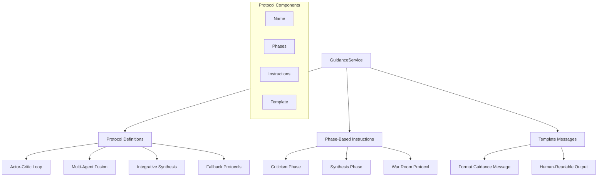

# How Guidance Works

The GuidanceService provides structured cognitive protocols and templates for "Guided" execution mode. This guide explains how CCT operates as an advisor rather than an autonomous actor, providing human-in-the-loop guidance for complex cognitive tasks.

## Overview

CCT's GuidanceService enables guided execution through:
- **Structured Protocols**: Pre-defined cognitive frameworks for each strategy
- **Phase-Based Instructions**: Multi-phase guidance for complex strategies
- **Template Messages**: Human-readable guidance for tool outputs
- **Persona Suggestions**: Recommended expert personas for multi-agent fusion
- **Fallback Guidance**: Default protocols for undefined strategies

**Key Features:**
- **Human-in-the-Loop**: Structured guidance instead of autonomous execution
- **Strategy-Specific Protocols**: Tailored guidance for each cognitive strategy
- **Clear Instructions**: Explicit phases and templates for each protocol
- **Persona Recommendations**: Expert personas for multi-agent scenarios
- **Consistent Formatting**: Standardized guidance message format

## Architecture



## Core Components

### GuidanceService

**Location**: `src/core/services/guidance/guidance.py` (lines 4-73)

The `GuidanceService` provides structured cognitive protocols for guided execution mode.

**Key Responsibilities:**
- Define protocol guidance for each thinking strategy
- Format human-readable guidance messages
- Provide phase-based instructions for complex strategies
- Suggest personas for multi-agent fusion
- Provide fallback guidance for undefined strategies

### Protocol Definitions

**Purpose**: Pre-defined cognitive frameworks for each strategy

**Implementation:**
```python
PROTOCOLS: Dict[ThinkingStrategy, Dict[str, Any]] = {
    ThinkingStrategy.ACTOR_CRITIC_LOOP: {
        "name": "Actor-Critic Loop",
        "phases": [
            {
                "name": "Criticism Phase",
                "persona": "Skeptic / Auditor",
                "instruction": (
                    "Critically evaluate the previous proposal. Identify architectural flaws, "
                    "security vulnerabilities, or scalability bottlenecks. Do not solve them yet."
                )
            },
            {
                "name": "Synthesis Phase",
                "persona": "Architect / Lead Artisan",
                "instruction": (
                    "Synthesize the original proposal with the criticisms. "
                    "Resolve the conflicts to formulate a robust, production-ready implementation."
                )
            }
        ],
        "template": (
            "ACTOR-CRITIC PROTOCOL:\n"
            "1. Critically attack the weaknesses of [TARGET].\n"
            "2. Evolve the solution based on those weaknesses."
        )
    },
    # ... other protocols
}
```

### Actor-Critic Loop Protocol

**Purpose**: Guidance for adversarial review and synthesis

**Phases:**

**Phase 1: Criticism Phase**
- **Persona**: Skeptic / Auditor
- **Instruction**: Critically evaluate the previous proposal. Identify architectural flaws, security vulnerabilities, or scalability bottlenecks. Do not solve them yet.
- **Purpose**: Identify weaknesses without proposing solutions

**Phase 2: Synthesis Phase**
- **Persona**: Architect / Lead Artisan
- **Instruction**: Synthesize the original proposal with the criticisms. Resolve the conflicts to formulate a robust, production-ready implementation.
- **Purpose**: Integrate criticisms into improved solution

**Template:**
```
ACTOR-CRITIC PROTOCOL:
1. Critically attack the weaknesses of [TARGET].
2. Evolve the solution based on those weaknesses.
```

### Multi-Agent Fusion Protocol

**Purpose**: Guidance for multi-perspective synthesis

**Components:**
```python
ThinkingStrategy.MULTI_AGENT_FUSION: {
    "name": "Multi-Agent Fusion",
    "instruction": (
        "Simulate a collaborative war room with specialized experts. "
        "Each expert provides a divergent perspective, which is then synthesized into a master conclusion."
    ),
    "suggested_personas": ["Systems Architect", "Security Engineer", "Product Manager", "UX Specialist"],
    "template": (
        "WAR ROOM PROTOCOL:\n"
        "1. Generate 3-4 divergent insights from [PERSONAS].\n"
        "2. Synthesize all insights into a single Unified Conclusion."
    )
}
```

**Suggested Personas:**
- Systems Architect
- Security Engineer
- Product Manager
- UX Specialist

**Template:**
```
WAR ROOM PROTOCOL:
1. Generate 3-4 divergent insights from [PERSONAS].
2. Synthesize all insights into a single Unified Conclusion.
```

### Integrative Synthesis Protocol

**Purpose**: Guidance for merging multiple findings

**Components:**
```python
ThinkingStrategy.INTEGRATIVE: {
    "name": "Integrative Synthesis",
    "instruction": "Merge all recent findings into a unified, high-density conclusion.",
    "template": "SYNTHESIS GOAL: Eliminate redundancy and resolve contradictions across [NODES]."
}
```

**Purpose:** Consolidate diverse inputs into single conclusion

### Fallback Guidance

**Purpose**: Default protocol for undefined strategies

**Implementation:**
```python
def get_guidance(self, strategy: ThinkingStrategy) -> Dict[str, Any]:
    """Returns the protocol guidance for a given strategy."""
    return self.PROTOCOLS.get(strategy, {
        "name": strategy.value.replace("_", " ").title(),
        "instruction": f"Proceed with the {strategy.value} cognitive strategy.",
        "template": "Focus on clarity and logical coherence."
    })
```

**Fallback Components:**
- **Name**: Strategy name in title case
- **Instruction**: Generic instruction to proceed
- **Template**: Focus on clarity and coherence

### Guidance Message Formatting

**Purpose**: Format human-readable guidance for tool output

**Implementation:**
```python
def format_guidance_message(self, strategy: ThinkingStrategy) -> str:
    """Formats a human-readable guidance message for the tool output."""
    guidance = self.get_guidance(strategy)
    msg = f"GUIDED MODE ACTIVATED: {guidance['name']}\n"
    msg += f"PROTOCOL: {guidance['instruction']}\n"
    if "template" in guidance:
        msg += f"TEMPLATE: {guidance['template']}"
    return msg
```

**Output Format:**
```
GUIDED MODE ACTIVATED: [Strategy Name]
PROTOCOL: [Instruction]
TEMPLATE: [Template]
```

## Integration Points

**With Hybrid Engines:**
```python
# Hybrid engines use guidance in guided mode
if mode == "guided":
    guidance_msg = guidance.format_guidance_message(strategy)
    guidance_thought = EnhancedThought(
        content=guidance_msg,
        thought_type=ThoughtType.PROTOCOL,
        strategy=strategy,
        tags=["guidance", "guided"]
    )
```

**With AutonomousService:**
```python
# AutonomousService determines execution mode
mode = autonomous.get_execution_mode(complexity)
if mode == "guided":
    # Use guidance instead of autonomous execution
    guidance_msg = guidance.format_guidance_message(strategy)
```

**With CognitiveOrchestrator:**
```python
# Orchestrator uses guidance for guided mode sessions
guidance_msg = guidance.format_guidance_message(next_strategy)
# Returns structured guidance message
```

## Execution Flow

### Guided Mode Example

```python
# 1. Determine execution mode
complexity = complexity_service.detect_complexity(problem_statement)
mode = autonomous.get_execution_mode(complexity)
# Returns: "guided"

# 2. Get guidance for strategy
strategy = ThinkingStrategy.ACTOR_CRITIC_LOOP
guidance_msg = guidance.format_guidance_message(strategy)

# Returns:
# GUIDED MODE ACTIVATED: Actor-Critic Loop
# PROTOCOL: Simulate a collaborative war room with specialized experts...
# TEMPLATE: WAR ROOM PROTOCOL:
# 1. Generate 3-4 divergent insights from [PERSONAS].
# 2. Synthesize all insights into a single Unified Conclusion.

# 3. Create guidance thought
guidance_thought = EnhancedThought(
    content=guidance_msg,
    thought_type=ThoughtType.PROTOCOL,
    strategy=strategy,
    tags=["guidance", "guided"]
)

# 4. Save to memory
memory.save_thought(session_id, guidance_thought)
```

## Protocol Comparison

| Strategy | Phases | Personas | Template |
|----------|--------|----------|----------|
| ACTOR_CRITIC_LOOP | 2 (Criticism, Synthesis) | Skeptic/Auditor, Architect/Lead | ACTOR-CRITIC PROTOCOL |
| MULTI_AGENT_FUSION | 1 (War Room) | Systems Architect, Security Engineer, etc. | WAR ROOM PROTOCOL |
| INTEGRATIVE | 1 (Synthesis) | None | SYNTHESIS GOAL |

## Performance Characteristics

**Human-in-the-Loop:**
- Structured guidance instead of autonomous execution
- Clear instructions for each cognitive phase
- Template-based consistency

**Token Efficiency:**
- Guidance messages are concise
- No LLM calls for guidance generation
- Pre-defined protocols reduce computation

**Quality Assurance:**
- Consistent protocol structure
- Clear phase boundaries
- Explicit instructions prevent ambiguity

## Code References

- **GuidanceService**: `src/core/services/guidance/guidance.py` (lines 4-73)
- **Actor-Critic Engine**: `src/modes/hybrids/critics/actor/orchestrator.py` (lines 26-218)
- **Multi-Agent Fusion Engine**: `src/modes/hybrids/multiagents/orchestrator.py` (lines 21-163)
- **AutonomousService**: `src/core/services/orchestration/autonomous.py` (lines 19-174)

## Whitepaper Reference

This documentation expands on **Section 3: The Brain's Advisor** of the main whitepaper, providing technical implementation details for the guided execution concept described there.

---

*See Also:*
- [How Hybrid Thinking Engine Works](./how-hybrid-thinking-engine-works.md)
- [How Routing Works](./how-routing-works.md)
- [How Autonomous/HITL Works](./how-autonomous-hitl-works.md)
- [Main Whitepaper](../whitepaper.md)
