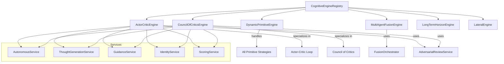

# How Hybrid Thinking Engine Works

The Hybrid Thinking Engines provide advanced multi-agent cognitive orchestration that combines multiple primitive strategies into sophisticated reasoning patterns. This guide explains how CCT's hybrid engines work through the CognitiveEngineRegistry and specialized orchestrators.

## Overview

CCT's hybrid engines are sophisticated orchestrators that combine multiple cognitive strategies into advanced reasoning patterns:
- **Actor-Critic Loop**: Automated stress-testing with adversarial review
- **Council of Critics**: Multi-specialist evaluation and consensus synthesis
- **Multi-Agent Fusion**: Divergent persona insights with convergent fusion
- **Long-Term Horizon**: Temporal reasoning across extended timeframes
- **Lateral Thinking**: Unconventional pivot strategies

**Key Features:**
- **Dynamic Registry**: Automatic mapping of strategies to engines
- **Cross-Model Audit**: External adversarial review eliminates echo chambers
- **Dual-Mode Operation**: Autonomous (LLM-powered) and guided (human-in-the-loop)
- **Identity Decoration**: Applies user's architectural DNA to all phases
- **Modular Design**: Reusable "Lego" principle across all hybrids

## Architecture



## Core Components

### CognitiveEngineRegistry

**Location**: `src/modes/registry.py` (lines 30-134)

The `CognitiveEngineRegistry` is the central registry that maps thinking strategies to cognitive engines.

**Registry Logic:**
```python
def _initialize_registry(self):
    """Maps hybrids manually and the rest automatically to the factory."""
    
    for strategy in ThinkingStrategy:
        # Special logic for Multi-Agent Fusion
        if strategy == ThinkingStrategy.MULTI_AGENT_FUSION:
            self._engines[strategy] = MultiAgentFusionEngine(...)
            continue
        
        # Mapping for other Hybrids
        hybrid_mapping = {
            ThinkingStrategy.ACTOR_CRITIC_LOOP: ActorCriticEngine,
            ThinkingStrategy.COUNCIL_OF_CRITICS: CouncilOfCriticsEngine,
            ThinkingStrategy.UNCONVENTIONAL_PIVOT: LateralEngine,
            ThinkingStrategy.LONG_TERM_HORIZON: LongTermHorizonEngine,
        }
        
        if strategy in hybrid_mapping:
            # Initialize specific hybrids
            self._engines[strategy] = engine_class(...)
        else:
            # Wrap all primitives into the Dynamic Engine
            self._engines[strategy] = DynamicPrimitiveEngine(
                self.memory, self.sequential, self.identity, self.scoring, strategy
            )
```

**Key Characteristics:**
- **Manual Hybrid Mapping**: Specialized engines for complex patterns
- **Dynamic Primitive Factory**: Single engine handles all primitive strategies
- **Service Injection**: Hybrid engines receive specialized services (review_service, etc.)
- **Strict Contract**: All engines implement `BaseCognitiveEngine`

### ActorCriticEngine

**Location**: `src/modes/hybrids/critics/actor/orchestrator.py` (lines 26-218)

The `ActorCriticEngine` implements an automated Actor-Critic stress-testing loop.

**Two-Phase Process:**

**Phase 1: The Critic (Adversarial Review)**
```python
if self.review_service:
    # Use external review service for cross-model audit
    review_outcome = await self.review_service.review(
        target_content=target_thought.content,
        persona=validated_input.critic_persona,
        system_prompt=None,
        primary_thought_service=self.thought_service
    )
    critic_content = review_outcome.content
    critic_source = review_outcome.source  # "external" or "external_cached"
else:
    # Fallback to primary LLM (single-model actor-critic)
    critic_content = await self.thought_service.generate_thought(
        prompt=critic_prompt,
        system_prompt=critic_sys_prompt
    )
    critic_source = "primary_llm"
```

**Phase 2: The Synthesis**
```python
synth_prompt = (
    f"ORIGINAL: {target_thought.content}\n"
    f"CRITIQUE: {critic_content}\n"
    f"INSTRUCTION: Resolve the conflicts and formulate a production-ready solution."
)
synthesis_content = await self.thought_service.generate_thought(
    prompt=synth_prompt,
    system_prompt=synthesis_sys_prompt
)
```

**Cross-Model Audit:**
- External review service uses different model for true adversarial review
- Eliminates "echo chamber" effect of same-model critique
- Falls back to primary LLM if external service unavailable
- Tracks source for audit trail (external vs primary_llm)

### CouncilOfCriticsEngine

**Location**: `src/modes/hybrids/critics/council/orchestrator.py` (lines 22-258)

The `CouncilOfCriticsEngine` orchestrates a panel of specialized critics for multi-domain evaluation.

**Two-Phase Process:**

**Phase 1: The Council (Multi-Specialist Evaluation)**
```python
for persona in validated_input.personas:
    # Each critic branches from the SAME target thought
    seq_context = self.sequential.process_sequence_step(
        session_id=session_id,
        branch_from_id=target_thought.id,
        branch_id=f"council_{persona.lower().replace(' ', '_')}"
    )
    
    # Generate persona critique
    critic_content = await self.thought_service.generate_thought(
        prompt=critic_prompt,
        system_prompt=critic_sys_prompt
    )
    
    critic_thought = EnhancedThought(
        id=generate_thought_id("council_critic"),
        content=critic_content,
        thought_type=ThoughtType.EVALUATION,
        strategy=ThinkingStrategy.CRITICAL,
        parent_id=target_thought.id,
        contradicts=[target_thought.id],
        tags=["council_of_critics", "evaluation", persona.lower()]
    )
```

**Phase 2: Convergent Synthesis (Consensus)**
```python
source_context = "\n\n".join([
    f"--- {p.id} ({p.strategy.value}) ---\n{p.content}" 
    for p in persona_nodes
])

synthesis_prompt = (
    f"ORIGINAL PROPOSAL: {target_thought.content}\n\n"
    f"COUNCIL CRITIQUES:\n{source_context}\n\n"
    f"INSTRUCTION: Aggregate all specialized criticisms into a singular, hardened implementation path. "
    f"Resolve contradictions, synthesize insights, and provide a consensus recommendation."
)
```

**Branching Structure:**
- Each critic creates a branch from the same target thought
- All branches are parallel (no sequence conflicts)
- Synthesis links to all critics for complete context

## Dual-Mode Operation

### Autonomous Mode

**Determines execution mode based on complexity:**
```python
mode = autonomous.get_execution_mode(session.complexity)

if mode == "autonomous":
    # Execute full LLM-powered automation
    # Generate thoughts, critiques, synthesis automatically
else:
    # Provide guidance for manual execution
    # Create protocol thoughts with instructions
```

**Autonomous Characteristics:**
- Full LLM-powered automation
- Generates actual cognitive content
- Executes multi-step reasoning automatically
- Best for well-understood domains

### Guided Mode

**Provides human-in-the-loop guidance:**
```python
if mode == "guided":
    guidance_msg = guidance.format_guidance_message(strategy)
    guidance_msg += f"\nSUGGESTED PERSONAS: {', '.join(validated_input.personas)}"
    
    guidance_thought = EnhancedThought(
        content=guidance_msg,
        thought_type=ThoughtType.PROTOCOL,
        strategy=strategy,
        tags=["guidance", "guided"]
    )
```

**Guided Characteristics:**
- Human-in-the-loop execution
- Provides structured guidance messages
- Creates protocol thoughts with instructions
- Best for mission-critical or novel domains

## Identity Decoration

All hybrid engines apply identity decoration to maintain architectural consistency:

```python
def _get_identity_decorated_system_prompt(self, session_id: str, base_system_prompt: str) -> str:
    """Helper to decorate prompts with identity context."""
    session = memory.get_session(session_id)
    if not session or not session.identity_layer:
        identity = identity.load_identity()
    else:
        identity = session.identity_layer
        
    prefix = identity.format_system_prefix(identity)
    return f"{prefix}\n\n{base_system_prompt}"
```

**Identity Components:**
- **USER_MINDSET**: User's architectural preferences and style
- **CCT_SOUL**: Digital twin persona and interaction style
- **Railway Decoration Pattern**: System prompt prefix injection

## Hybrid Engine Taxonomy

### Critic-Based Hybrids
- **ACTOR_CRITIC_LOOP**: Single critic with synthesis
- **COUNCIL_OF_CRITICS**: Multi-critic panel with consensus

### Fusion-Based Hybrids
- **MULTI_AGENT_FUSION**: Divergent personas with convergent fusion

### Temporal Hybrids
- **LONG_TERM_HORIZON**: Extended timeframe reasoning

### Lateral Hybrids
- **UNCONVENTIONAL_PIVOT**: Unconventional perspective shifts

## Integration Points

**With CognitiveOrchestrator:**
```python
# Orchestrator uses registry to get engines
engine = registry.get_engine(strategy)
result = await engine.execute(session_id, input_payload)
```

**With AdversarialReviewService:**
```python
# Actor-Critic uses external review for cross-model audit
review_outcome = await review_service.review(
    target_content=target_thought.content,
    persona=persona,
    primary_thought_service=thought_service
)
```

**With FusionOrchestrator:**
```python
# Multi-Agent Fusion uses FusionOrchestrator for convergence
fusion_thought = fusion.fuse_thoughts(
    session_id=session_id,
    thought_ids=[n.id for n in persona_nodes],
    synthesis_goal=synthesis_goal
)
```

**With AutonomousService:**
```python
# Determines execution mode
mode = autonomous.get_execution_mode(session.complexity)
```

## Execution Flow

### Actor-Critic Example

```python
input_payload = {
    "target_thought_id": "thought_abc123",
    "critic_persona": "Security Architect"
}

result = await actor_critic_engine.execute(
    session_id="session_xyz789",
    input_payload=input_payload
)

# Returns:
# {
#     "status": "success",
#     "orchestration_mode": "actor_critic_loop",
#     "target_thought_id": "thought_abc123",
#     "critic_phase": {
#         "generated_id": "critic_def456",
#         "strategy": "critical",
#         "source": "external"
#     },
#     "synthesis_phase": {
#         "generated_id": "synth_ghi789",
#         "strategy": "dialectical",
#         "is_revision": true
#     },
#     "cross_model_audit": true
# }
```

### Council of Critics Example

```python
input_payload = {
    "target_thought_id": "thought_abc123",
    "personas": ["Security Architect", "Database Expert", "Frontend Engineer"]
}

result = await council_of_critics_engine.execute(
    session_id="session_xyz789",
    input_payload=input_payload
)

# Returns:
# {
#     "status": "success",
#     "orchestration_mode": "autonomous",
#     "council_size": 3,
#     "critic_ids": ["council_1", "council_2", "council_3"],
#     "consensus_id": "council_synth",
#     "current_step": 7
# }
```

## Performance Characteristics

**Cross-Model Audit:**
- External review eliminates echo chambers
- Cached responses improve latency
- Fallback to primary LLM ensures reliability

**Branching Efficiency:**
- Parallel branches avoid sequence conflicts
- Each branch is independent and isolated
- Tree structure enables complex reasoning paths

**Token Optimization:**
- Guided mode reduces LLM calls
- Autonomous mode uses efficient models
- Identity decoration reduces need for context

## Code References

- **CognitiveEngineRegistry**: `src/modes/registry.py` (lines 30-134)
- **ActorCriticEngine**: `src/modes/hybrids/critics/actor/orchestrator.py` (lines 26-218)
- **CouncilOfCriticsEngine**: `src/modes/hybrids/critics/council/orchestrator.py` (lines 22-258)
- **MultiAgentFusionEngine**: `src/modes/hybrids/multiagents/orchestrator.py` (lines 21-163)
- **BaseCognitiveEngine**: `src/modes/base.py` (lines 17-100)

## Whitepaper Reference

This documentation expands on **Section 2: Hybrid Modes (The Orchestrators)** of the main whitepaper, providing technical implementation details for the concepts described there.

---

*See Also:*
- [How Fusion Thinking Engine Works](./how-fusion-thinking-engine-works.md)
- [How Primitives Thinking Engine Works](./how-primitives-thinking-engine-works.md)
- [How Memory Works](./how-memory-works.md)
- [Main Whitepaper](../whitepaper.md)
