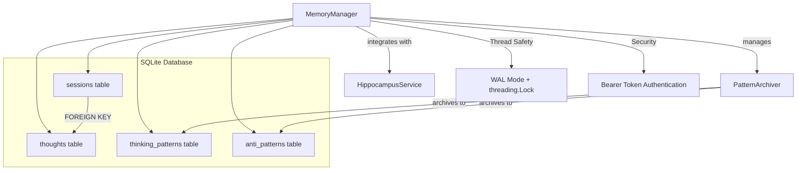

# How Memory Works

The CCT memory system provides persistent cognitive storage that enables the AI to learn, remember, and evolve across sessions. This guide explains the architecture and implementation of CCT's memory layer.

## Overview

CCT implements a **SQLite-backed Document Store Pattern** for memory management, providing:
- **Session Persistence**: Cognitive sessions survive server restarts
- **Thought Storage**: Every thought node is persistently stored with full context
- **Pattern Learning**: Elite thinking patterns are archived for future reuse
- **Anti-Pattern Storage**: Failures are remembered to build a cognitive immune system
- **Security**: Bearer token authentication prevents unauthorized access

## Architecture



## Core Components

### MemoryManager

**Location**: `src/engines/memory/manager.py`

The `MemoryManager` class is the central memory component that handles all database operations.

**Key Features:**
- **SQLite WAL Mode**: Enables concurrent reads without blocking
- **Thread Safety**: Uses `threading.Lock` to serialize write operations
- **Document Store Pattern**: Stores data as flexible JSON blobs
- **Security**: Path traversal prevention and bearer token validation

**Database Schema:**

```sql
-- Sessions table: Stores session state as JSON
CREATE TABLE sessions (
    session_id TEXT PRIMARY KEY,
    data JSON NOT NULL
)

-- Thoughts table: Stores individual thought nodes
CREATE TABLE thoughts (
    thought_id TEXT PRIMARY KEY,
    session_id TEXT,
    data JSON NOT NULL,
    FOREIGN KEY(session_id) REFERENCES sessions(session_id)
)

-- Thinking patterns table: Stores elite cognitive patterns
CREATE TABLE thinking_patterns (
    tp_id TEXT PRIMARY KEY,
    thought_id TEXT,
    usage_count INTEGER DEFAULT 1,
    data JSON NOT NULL
)

-- Anti-patterns table: Stores failures for cognitive immune system
CREATE TABLE anti_patterns (
    failure_id TEXT PRIMARY KEY,
    thought_id TEXT,
    failed_strategy TEXT,
    category TEXT,
    data JSON NOT NULL
)
```

**Performance Indexes:**
- `idx_thoughts_session`: Fast session history retrieval
- `idx_thoughts_thought_id`: Direct thought lookup
- `idx_patterns_usage`: Top pattern retrieval by usage
- `idx_anti_patterns_strategy`: Anti-pattern lookup by strategy
- `idx_anti_patterns_category`: Anti-pattern lookup by category

### Session Management

**Session Creation:**
```python
session = memory_manager.create_session(
    problem_statement="Design a scalable microservice architecture",
    profile=CCTProfile.ARCHITECT,
    estimated_thoughts=10,
    model_id="claude-3-5-sonnet-20240620",
    suggested_pipeline=[ThinkingStrategy.BRAINSTORMING, ...],
    complexity="high"
)
```

Each session receives:
- **Unique Session ID**: `session_{uuid}`
- **Bearer Token**: 32-byte cryptographically random token for authentication
- **Session State**: Complete state persisted as JSON

**Session Security:**
```python
# Validate session token before access
if memory_manager.validate_session_token(session_id, token):
    # Access granted
    session = memory_manager.get_session(session_id)
else:
    # Access denied
    raise SecurityError("Invalid session token")
```

The `validate_session_token` method uses `secrets.compare_digest` to prevent timing attacks on token comparison.

### Thought Storage

**Saving Thoughts:**
```python
thought = EnhancedThought(
    id=f"thought_{uuid}",
    content="The microservice should use event-driven architecture...",
    strategy=ThinkingStrategy.FIRST_PRINCIPLES,
    metrics=ThoughtMetrics(
        clarity_score=0.85,
        logical_coherence=0.92,
        novelty_score=0.78,
        evidence_strength=0.88
    ),
    # ... other fields
)

memory_manager.save_thought(session_id, thought)
```

The `save_thought` method:
1. Saves the thought node to the database
2. Updates the session's history atomically (within the same transaction)
3. Maintains the thought sequence order

**Thought Retrieval:**
```python
# Get specific thought
thought = memory_manager.get_thought(thought_id)

# Get full session history in order
history = memory_manager.get_session_history(session_id)
```

### PatternArchiver

**Location**: `src/engines/memory/thinking_patterns.py`

The `PatternArchiver` implements **Long-Term Potentiation (LTP)** - the biological concept that neural pathways strengthen with use.

**Golden Thinking Patterns:**
Elite thoughts that meet specific thresholds are automatically archived:
- **Logical Coherence >= 0.9**
- **Evidence Strength >= 0.8**

```python
archiver = PatternArchiver(
    memory=memory_manager,
    tp_threshold=0.9,
    evidence_threshold=0.8
)

result = archiver.archive_thought(thought, session_id)
if result.archived:
    # Thought archived as Golden Thinking Pattern
    pattern_id = result.pattern_id
```

**Pattern Strengthening:**
```python
# Each time a pattern is reused, its usage count increases
memory_manager.record_pattern_usage(pattern_id)
```

Patterns are ranked by usage count - the most used patterns represent the strongest neural pathways.

**Anti-Pattern Archiving:**
```python
archiver.archive_anti_pattern(
    thought=thought,
    session_id=session_id,
    failure_reason="Tight coupling between services",
    corrective_action="Introduce message broker for decoupling",
    category="architecture"
)
```

Anti-patterns build a **Cognitive Immune System** that prevents the AI from repeating the same mistakes.

**Context Tree Export:**
Golden patterns are automatically exported to markdown files in `docs/context-tree/Thinking-Patterns/`:
```markdown
---
title: "Event-driven microservice pattern..."
tags: ["architecture", "scalability"]
tp_id: "gtp_abc123"
thought_id: "thought_xyz"
logic_score: 0.92
evidence_score: 0.88
---

# Golden Thinking Pattern: gtp_abc123

## Problem Context
> The microservice should use event-driven architecture...

## Cognitive Strategy: First_Principles
[Full content of the elite thought]

## Metadata
- **Archived At:** 2026-04-15T10:30:00Z
- **Usage Count:** 5
```

### HippocampusService

**Location**: `src/core/services/learning/hippocampus.py`

The `HippocampusService` implements **Strategic Human Assistance** by learning the user's architectural style from interactions.

**Learning Mechanism:**
```python
hippocampus = HippocampusService(
    memory=memory_manager,
    identity_service=identity_service
)

# Analyze a session to extract architectural patterns
learned_identity = hippocampus.analyze_session(session_id)
```

The service extracts:
- **Architectural Preferences**: Patterns the user approves (DDD, Clean Architecture, SOLID)
- **Architectural Rejections**: Anti-patterns the user criticizes (spaghetti code, god objects)
- **Cognitive Patterns**: Thinking style patterns (critical evaluation, synthesis)

**Dynamic Identity Generation:**
```python
# Generate dynamic USER_MINDSET based on learned patterns
dynamic_mindset = hippocampus.generate_dynamic_mindset()

# Generate dynamic CCT_SOUL based on learned patterns
dynamic_soul = hippocampus.generate_dynamic_soul()

# Get enhanced identity (dynamic, static, or hybrid)
enhanced_identity = hippocampus.get_enhanced_identity()
```

The service provides three identity modes:
- **Dynamic**: Fully learned identity (10+ interactions)
- **Hybrid**: Static defaults + learned enhancements (5-10 interactions)
- **Static**: Default identity only (0-5 interactions)

## Tree of Thoughts: Branch Management

CCT supports branching exploration of multiple solution paths.

**Get Branch Tree:**
```python
tree = memory_manager.get_branch_tree(session_id)
# Returns tree structure showing all branches and their relationships
```

**Compare Branches:**
```python
comparison = memory_manager.compare_branches(
    session_id=session_id,
    branch_ids=["branch_1", "branch_2", "branch_3"]
)
# Returns comparison metrics for each branch
```

**Prune Branch:**
```python
result = memory_manager.prune_branch(
    session_id=session_id,
    branch_root_id="thought_abc",
    reason="low coherence score"
)
```

**Promote Branch:**
```python
result = memory_manager.promote_branch(
    session_id=session_id,
    branch_root_id="thought_xyz"
)
# Promotes a branch to be the mainline path
```

## Security Features

### Path Traversal Prevention
```python
# [SECURITY C2] Harden db_path to prevent path traversal attacks
resolved = os.path.abspath(db_path)
project_root = os.path.abspath(os.getcwd())
if not resolved.startswith(project_root):
    raise ValueError("Path traversal attack detected")
```

### Bearer Token Authentication
```python
# Generate cryptographically random token
session_token = secrets.token_urlsafe(32)

# Validate with timing attack prevention
return secrets.compare_digest(session.session_token, provided_token)
```

### Audit Logging
Every write operation emits a structured audit log:
```python
_audit_log("SESSION_CREATE", session_id, f"profile={profile.value}")
_audit_log("THOUGHT_UPDATE", thought.id, f"session={session_id}")
_audit_log("PATTERN_ARCHIVE", pattern.id, f"thought={thought_id}")
```

## Integration Points

**With CognitiveOrchestrator:**
```python
# Orchestrator uses MemoryManager for session lifecycle
session = memory_manager.create_session(...)
history = memory_manager.get_session_history(session_id)
```

**With PatternArchiver:**
```python
# Archiver uses MemoryManager for pattern persistence
memory_manager.save_thinking_pattern(pattern)
memory_manager.save_anti_pattern(anti_pattern)
```

**With HippocampusService:**
```python
# Hippocampus uses MemoryManager for session analysis
history = memory_manager.get_session_history(session_id)
```

## Performance Characteristics

**Concurrency:**
- WAL mode allows concurrent reads without blocking
- threading.Lock serializes writes to prevent "database is locked" errors
- Designed for FastMCP's concurrent async tool handler execution

**Query Performance:**
- Indexed lookups for session history, patterns, and anti-patterns
- JSON blob storage provides flexibility while maintaining query performance
- Optimized for read-heavy workloads (typical cognitive session patterns)

**Storage Efficiency:**
- JSON compression for large thought content
- Indexed queries prevent full table scans
- Automatic cleanup of old sessions (via delete_session)

## Code References

- **MemoryManager**: `src/engines/memory/manager.py` (lines 35-702)
- **PatternArchiver**: `src/engines/memory/thinking_patterns.py` (lines 38-366)
- **HippocampusService**: `src/core/services/learning/hippocampus.py` (lines 50-427)

## Whitepaper Reference

This documentation expands on **Section 5: The Digital Hippocampus** of the main whitepaper, providing technical implementation details for the concepts described there.

---

*See Also:*
- [How Continuous Learning Works](./how-continous-learning-works.md)
- [How Sequential Thinking Works](./how-sequential-thinking-works.md)
- [Main Whitepaper](../whitepaper.md)
