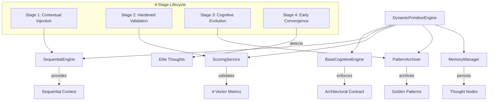

# How Primitives Thinking Engine Works

The Primitives Thinking Engine provides the atomic cognitive workers that form the foundation of CCT's reasoning capabilities. This guide explains how the `DynamicPrimitiveEngine` processes all primitive cognitive strategies through a unified factory pattern.

## Overview

CCT's `DynamicPrimitiveEngine` is a dynamic factory engine capable of processing all primitive cognitive strategies. It eliminates code duplication while maintaining strict architectural contracts across 25+ different thinking strategies.

**Key Features:**
- **Unified Factory Pattern**: Single engine handles all primitive strategies
- **4-Stage Processing Lifecycle**: Contextual injection, hardened validation, cognitive evolution, early convergence
- **Token-Optimized Scoring**: 4000 token budget for efficient analysis
- **Automatic Pattern Archiving**: Elite thoughts become reusable patterns
- **Strict Architectural Contract**: Enforced via `BaseCognitiveEngine`

## Architecture



## Core Components

### DynamicPrimitiveEngine

**Location**: `src/modes/primitives/orchestrator.py` (lines 20-141)

The `DynamicPrimitiveEngine` is a dynamic factory that processes all primitive cognitive strategies.

**Key Characteristics:**
- **Strategy-Agnostic**: Handles any `ThinkingStrategy` enum value
- **Unified Lifecycle**: Same 4-stage processing for all primitives
- **Token-Optimized**: Uses efficient scoring with 4000 token budget
- **Auto-Pilot Learning**: Automatically archives elite patterns

### BaseCognitiveEngine

**Location**: `src/modes/base.py` (lines 17-100)

The `BaseCognitiveEngine` enforces the strict architectural contract for all 25+ cognitive engines.

**Contract Requirements:**
```python
class BaseCognitiveEngine(ABC):
    @property
    @abstractmethod
    def strategy_type(self) -> ThinkingStrategy:
        """Defines the specific ThinkingStrategy this engine handles."""
        pass
    
    @abstractmethod
    def execute(self, session_id: str, input_payload: Dict[str, Any]) -> Dict[str, Any]:
        """The core execution block for the cognitive strategy."""
        pass
```

**Shared Utilities:**
- `_generate_thought_id()`: Creates unique thought identifiers
- `_get_session_or_raise()`: Centralized session validation
- `_get_thought_or_raise()`: Centralized thought validation
- `_validate_payload()`: Schema validation
- `_link_thought_to_parent()`: Parent-child relationship management

## 4-Stage Primitive Processing Lifecycle

### Stage 1: Contextual Injection

**Purpose**: Retrieve state from SequentialEngine to understand position in branching "Tree of Thought"

```python
seq_context = self.sequential.process_sequence_step(
    session_id=session_id,
    llm_thought_number=validated_input.thought_number,
    llm_estimated_total=validated_input.estimated_total_thoughts,
    next_thought_needed=validated_input.next_thought_needed,
    is_revision=validated_input.is_revision,
    revises_id=validated_input.revises_thought_id,
    branch_from_id=validated_input.branch_from_id,
    branch_id=validated_input.branch_id
)
```

**What It Provides:**
- Current thought number in sequence
- Estimated total thoughts
- Revision status
- Branch information (parent and branch IDs)
- Next thought needed flag

**Why It Matters:**
- Ensures the primitive worker has context of previous thoughts
- Maintains awareness of branching structure
- Prevents cognitive disconnection in complex reasoning

### Stage 2: Hardened Validation

**Purpose**: Every thought is immediately audited by ScoringService with quantitative metrics

```python
history = self.memory.get_session_history(session_id)
thought.metrics = self.scoring.analyze_thought(thought, history, token_budget=MAX_ANALYSIS_TOKEN_BUDGET)
thought.summary = self.scoring.generate_summary(thought.content)
```

**4-Vector Metrics:**
- **Clarity Score**: Measures precision and syntactic quality
- **Logical Coherence**: Evaluates alignment with parent thought
- **Novelty Score**: Compares against session history for exploration
- **Evidence Strength**: Scans for grounding markers (code, data, proofs)

**Token Optimization:**
```python
MAX_ANALYSIS_TOKEN_BUDGET = 4000  # Token budget for analysis
```

The scoring is optimized to use only 4000 tokens for analysis, preventing runaway costs while maintaining quality validation.

### Stage 3: Cognitive Evolution

**Purpose**: PatternArchiver automatically promotes elite thoughts to Golden Thinking Patterns

```python
pattern = self.archiver.process_thought(session, thought)
```

**Elite Thought Criteria:**
```python
logical_coherence >= 0.9 AND evidence_strength >= 0.8
```

**Pattern Strengthening:**
- Elite thoughts become Golden Thinking Patterns
- Each reuse increments usage count (LTP effect)
- Patterns are ranked by usage - strongest neural pathways first
- Automatically exported to Context Tree markdown

**Why It Matters:**
- Implements Long-Term Potentiation (LTP) - patterns strengthen with use
- Enables the AI to learn from its own elite reasoning
- Provides reusable cognitive patterns for future sessions

### Stage 4: Early Convergence Detection

**Purpose**: Detect "Breakthrough" thoughts that meet victory conditions to save tokens

```python
early_convergence = False
if pattern and thought.metrics.logical_coherence > DEFAULT_TP_THRESHOLD:
    early_convergence = True
    logger.info("🚩 Dynamic Threshold Triggered: Elite thought detected. Problem potentially solved.")
```

**Dynamic Threshold:**
```python
DEFAULT_TP_THRESHOLD = 0.9
```

**What Triggers Early Convergence:**
- Thought archived as Golden Pattern (elite quality)
- Logical coherence exceeds 0.9 threshold
- Evidence strength already validated by Stage 2

**Why It Matters:**
- Saves significant tokens by stopping when solution is found
- Prevents overthinking on solved problems
- Maintains quality through elite threshold requirements

## Primitive Taxonomy

### Functional Workers
- **LINEAR**: Sequential, step-by-step reasoning
- **SYSTEMATIC**: Methodical, organized approach
- **CRITICAL**: Evaluative, judgment-focused
- **DIALECTICAL**: Thesis-antithesis-synthesis
- **ANALYTICAL**: Decomposition and analysis

### Advanced Workers
- **FIRST_PRINCIPLES**: Assumption deconstruction
- **ABDUCTIVE**: Inference to best explanation
- **EMPIRICAL_RESEARCH**: Fact gathering and validation
- **COUNTERFACTUAL**: Alternative scenario exploration
- **DEDUCTIVE_VALIDATION**: Logical proof verification

### Agentic Workers (Dedicated Engines)
- **REACT**: Reasoning + Acting loop
- **REWOO**: ReWOO planning pattern
- **TREE_OF_THOUGHTS**: Branching exploration
- **CHAIN_OF_THOUGHT**: Linear reasoning chain
- **PLAN_AND_EXECUTE**: Planning then execution

### Strategic Workers
- **SWOT_ANALYSIS**: Strengths, Weaknesses, Opportunities, Threats
- **SECOND_ORDER_THINKING**: Consequences of consequences
- **FIRST_PRINCIPLES_ECON**: Economic first principles

## Execution Flow

### Complete Execution Example

```python
# Input payload from MCP tool
input_payload = {
    "thought_number": 5,
    "estimated_total_thoughts": 10,
    "next_thought_needed": True,
    "thought_content": "The microservice should use event-driven architecture...",
    "thought_type": "analysis",
    "is_revision": False,
    "revises_thought_id": None,
    "branch_from_id": None,
    "branch_id": None
}

# Execute primitive step
result = await primitive_engine.execute(
    session_id="session_abc123",
    input_payload=input_payload
)

# Returns:
# {
#     "status": "success",
#     "orchestration_mode": "first_principles",
#     "generated_thought_id": "fir_143052_abc123",
#     "is_thinking_pattern": True,
#     "early_convergence_suggested": False,
#     "current_step": 5,
#     "estimated_total": 10,
#     "metrics": {
#         "clarity": 0.85,
#         "coherence": 0.92,
#         "novelty": 0.78,
#         "evidence": 0.88
#     }
# }
```

## Integration Points

**With CognitiveOrchestrator:**
```python
# Orchestrator instantiates DynamicPrimitiveEngine for each primitive strategy
primitive_engine = DynamicPrimitiveEngine(
    memory_manager=memory_manager,
    sequential_engine=sequential_engine,
    identity_service=identity_service,
    scoring_engine=scoring_engine,
    strategy=ThinkingStrategy.FIRST_PRINCIPLES
)
```

**With SequentialEngine:**
```python
# Primitive engine processes sequence step for context
seq_context = sequential.process_sequence_step(...)
thought.sequential_context = seq_context
```

**With ScoringService:**
```python
# Primitive engine validates every thought
thought.metrics = scoring.analyze_thought(thought, history, token_budget=4000)
```

**With PatternArchiver:**
```python
# Primitive engine auto-archives elite patterns
pattern = archiver.process_thought(session, thought)
```

## Performance Characteristics

**Token Efficiency:**
- 4000 token budget for scoring analysis
- Early convergence saves tokens on solved problems
- Optimized history retrieval for scoring context

**Code Efficiency:**
- Single engine handles 25+ strategies
- Eliminates code duplication
- Unified lifecycle reduces maintenance overhead

**Learning Efficiency:**
- Automatic pattern archiving
- Pattern strengthening with reuse
- Elite threshold ensures quality

## Code References

- **DynamicPrimitiveEngine**: `src/modes/primitives/orchestrator.py` (lines 20-141)
- **BaseCognitiveEngine**: `src/modes/base.py` (lines 17-100)
- **ThinkingStrategy Enum**: `src/core/models/enums.py` (lines 3-53)
- **Constants**: `src/core/constants.py` (DEFAULT_TP_THRESHOLD, MAX_ANALYSIS_TOKEN_BUDGET)

## Whitepaper Reference

This documentation expands on **Section 2.A: The Atomic Workers: Primitives** of the main whitepaper, providing technical implementation details for the concepts described there.

---

*See Also:*
- [How Memory Works](./how-memory-works.md)
- [How Sequential Thinking Works](./how-sequential-thinking-works.md)
- [How Analysis Works](./how-analysis-works.md)
- [How Continuous Learning Works](./how-continous-learning-works.md)
- [Main Whitepaper](../whitepaper.md)
