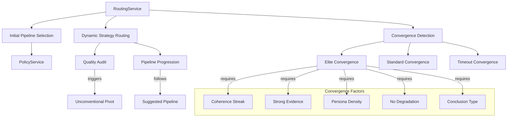

# How Routing Works

The RoutingService is CCT's dynamic cognitive strategy decider that implements the "Automatic Pipeline" requirement. This guide explains how CCT dynamically determines reasoning paths based on problem statements, real-time scoring feedback, and convergence detection.

## Overview

CCT's RoutingService provides intelligent strategy selection through:
- **Initial Pipeline Selection**: Domain-based pipeline determination
- **Dynamic Strategy Routing**: Real-time adaptation based on quality metrics
- **Quality Degradation Detection**: Automatic pivot triggers for low-quality thoughts
- **Convergence Detection**: Multi-factor analysis for early termination
- **Pipeline Progression**: Following suggested cognitive pipelines

**Key Features:**
- **Automatic Pipeline**: AI determines reasoning path dynamically
- **Quality-Aware Routing**: Clarity and coherence thresholds trigger pivots
- **Convergence Factors**: 5-factor analysis for early finish detection
- **Metrics Integration**: Performance tracking for routing decisions
- **Domain Policy Integration**: Delegates to PolicyService for pipeline selection

## Architecture



## Core Components

### RoutingService

**Location**: `src/core/services/orchestration/routing.py` (lines 15-313)

The `RoutingService` implements the IntelligenceRouter pattern for dynamic cognitive strategy decision-making.

**Key Responsibilities:**
- Determine initial pipeline based on problem statement
- Select next strategy based on real-time metrics
- Detect quality degradation and trigger pivots
- Check convergence for early termination
- Track routing performance metrics

### Initial Pipeline Selection

**Purpose**: Select appropriate cognitive pipeline based on problem statement

**Implementation:**
```python
def determine_initial_pipeline(self, problem_statement: str) -> List[ThinkingStrategy]:
    """
    Delegates initial pipeline selection to the Domain Policy Manager.
    """
    return PipelineSelector.select_pipeline(problem_statement)
```

**Pipeline Options:**
- **ARCH**: Architecture-focused tasks (brainstorming, engineering deconstruction, first principles, systemic, council of critics)
- **SOVEREIGN**: Mission-critical tasks (brainstorming, engineering deconstruction, systemic, deductive validation, post-mission learning)
- **COMPLEX**: Complex tasks (brainstorming, engineering deconstruction, systematic, actor-critic loop, post-mission learning)
- **SIMPLE**: Simple tasks (guided mode by default)

### Dynamic Strategy Routing

**Purpose**: Decide next strategy based on real-time scoring feedback

**Routing Logic:**
```python
def next_strategy(
    self, 
    session: CCTSessionState, 
    recent_thoughts: List[EnhancedThought]
) -> ThinkingStrategy:
    """
    Main routing logic for the 'Automatic Pipeline'.
    Decides if we should follow the current pipeline, pivot, or trigger fusion.
    """
    if not recent_thoughts:
        return session.suggested_pipeline[0]

    last_thought = recent_thoughts[-1]
    metrics = last_thought.metrics

    # 1. Check for Terminal Convergence
    if len(recent_thoughts) >= 3:
        if all("persona_insight" in t.tags for t in recent_thoughts[-2:]):
            return ThinkingStrategy.MULTI_AGENT_FUSION

    # 2. Check for Quality Degradation (Pivot Logic)
    if (metrics.clarity_score < self.PIVOT_THRESHOLD_CLARITY or 
        metrics.logical_coherence < self.PIVOT_THRESHOLD_COHERENCE):
        return ThinkingStrategy.UNCONVENTIONAL_PIVOT

    # 3. Follow the suggested pipeline
    current_index = session.current_thought_number
    pipeline = session.suggested_pipeline
    
    if pipeline and 0 <= current_index < len(pipeline):
        return pipeline[current_index]

    # 4. Fallback to Final Synthesis
    return ThinkingStrategy.INTEGRATIVE
```

**Routing Priority:**
1. **Convergence**: High-density persona insights trigger fusion
2. **Quality Degradation**: Low clarity/coherence triggers unconventional pivot
3. **Pipeline Progression**: Follow suggested pipeline steps
4. **Fallback**: Integrative synthesis for final conclusion

### Quality Degradation Detection

**Purpose**: Detect when thought quality drops below acceptable thresholds

**Pivot Thresholds:**
```python
PIVOT_THRESHOLD_CLARITY = 0.6  # From constants
PIVOT_THRESHOLD_COHERENCE = 0.7  # From constants
```

**Pivot Trigger:**
```python
if (metrics.clarity_score < self.PIVOT_THRESHOLD_CLARITY or 
    metrics.logical_coherence < self.PIVOT_THRESHOLD_COHERENCE):
    logger.warning(
        f"[ROUTER] Quality Drop Detected - Triggering UNCONVENTIONAL_PIVOT | "
        f"clarity={metrics.clarity_score:.3f} (threshold: {self.PIVOT_THRESHOLD_CLARITY}) | "
        f"coherence={metrics.logical_coherence:.3f} (threshold: {self.PIVOT_THRESHOLD_COHERENCE})"
    )
    return ThinkingStrategy.UNCONVENTIONAL_PIVOT
```

**Unconventional Pivot:**
- Forces paradigm shift to break cognitive deadlocks
- Provocative methods challenge assumptions
- Breaks repetitive low-quality thought patterns

### Convergence Detection

**Purpose**: Determine when reasoning has reached a satisfactory conclusion

**5-Factor Analysis:**
```python
def _calculate_convergence_factors(self, recent_thoughts: List[EnhancedThought]) -> Dict[str, bool]:
    """
    Calculate individual convergence factors for multi-factor analysis.
    
    Returns dictionary with 5 boolean factors:
    - coherence_streak: High coherence for 2+ consecutive thoughts
    - strong_evidence: Evidence strength >= 0.8
    - high_persona_density: 2+ persona insights in recent thoughts
    - no_degradation: No quality degradation in last 3 steps
    - is_conclusion: Conclusion type with high evidence
    """
    last = recent_thoughts[-1]
    metrics = last.metrics
    recent_metrics = [t.metrics for t in recent_thoughts[-3:] if t.metrics]
    
    return {
        "coherence_streak": all(
            m.logical_coherence >= 0.95 for m in recent_metrics[-2:]
        ) if len(recent_metrics) >= 2 else False,
        "strong_evidence": metrics.evidence_strength >= 0.8,
        "high_persona_density": sum(
            1 for t in recent_thoughts[-3:] if "persona_insight" in t.tags
        ) >= 2,
        "no_degradation": all(
            m.clarity_score >= self.PIVOT_THRESHOLD_CLARITY and 
            m.logical_coherence >= self.PIVOT_THRESHOLD_COHERENCE
            for m in recent_metrics
        ),
        "is_conclusion": last.thought_type == "conclusion" and metrics.evidence_strength > 0.8
    }
```

**Elite Convergence (4/5 factors):**
```python
def _check_elite_convergence(self, session: CCTSessionState, metrics, factors: Dict[str, bool]) -> bool:
    """
    Check for elite convergence (score >= 4/5 factors).
    
    Elite convergence triggers early finish when multiple convergence
    factors are simultaneously satisfied.
    """
    convergence_score = sum(factors.values())
    
    if convergence_score >= 4:
        reasons = []
        if factors["coherence_streak"]: reasons.append("high_coherence_streak")
        if factors["strong_evidence"]: reasons.append("strong_evidence")
        if factors["high_persona_density"]: reasons.append("persona_insights")
        if factors["no_degradation"]: reasons.append("no_degradation")
        if factors["is_conclusion"]: reasons.append("conclusion_type")
        
        logger.info(
            f"[ROUTER] Early Convergence Detected (score={convergence_score}/5): {', '.join(reasons)}"
        )
        return True
    return False
```

**Standard Convergence:**
```python
def _check_standard_convergence(self, session: CCTSessionState, metrics, is_conclusion: bool) -> bool:
    """
    Check for standard convergence (conclusion type with high evidence).
    """
    if is_conclusion:
        logger.info(
            f"[ROUTER] Standard Convergence: Conclusion with high evidence strength | "
            f"evidence={metrics.evidence_strength:.3f}"
        )
        return True
    return False
```

**Timeout Convergence:**
```python
def _check_timeout_convergence(self, session: CCTSessionState, metrics) -> bool:
    """
    Check for timeout convergence (reached estimated steps with acceptable quality).
    """
    if session.current_thought_number >= session.estimated_total_thoughts:
        if metrics.logical_coherence > 0.7:
            logger.info(
                f"[ROUTER] Timeout Convergence: Estimated steps completed with acceptable coherence"
            )
            return True
    return False
```

### Pipeline Progression

**Purpose**: Follow suggested cognitive pipeline steps

**Implementation:**
```python
# 3. Follow the suggested pipeline
current_index = session.current_thought_number
pipeline = session.suggested_pipeline

if pipeline and 0 <= current_index < len(pipeline):
    next_strat = pipeline[current_index]
    logger.info(
        f"[ROUTER] Proceeding with planned pipeline | "
        f"step={current_index}/{len(pipeline)} | "
        f"next_strategy={next_strat.value}"
    )
    return next_strat
```

**Progression Tracking:**
- Current thought number determines pipeline step
- Metrics recorded for each pipeline progression
- Fallback to integrative synthesis when pipeline exhausted

## Integration Points

**With PolicyService:**
```python
# Delegates initial pipeline selection
pipeline = PipelineSelector.select_pipeline(problem_statement)
```

**With ScoringService:**
```python
# Uses metrics for quality degradation detection
metrics = last_thought.metrics
if metrics.clarity_score < PIVOT_THRESHOLD_CLARITY:
    return ThinkingStrategy.UNCONVENTIONAL_PIVOT
```

**With MetricsService:**
```python
# Records routing decisions for performance tracking
record_engine_execution(
    engine_name="IntelligenceRouter",
    strategy="PIVOT_TRIGGER",
    execution_time_ms=0.0,
    # ... metrics
    session_id=session.session_id
)
```

**With CognitiveOrchestrator:**
```python
# Orchestrator uses routing for strategy selection
next_strategy = routing.next_strategy(session, recent_thoughts)
result = await engine.execute(session_id, input_payload)
```

## Execution Flow

### Complete Routing Example

```python
# 1. Initial pipeline selection
problem_statement = "Design a scalable payment processing system..."
pipeline = routing.determine_initial_pipeline(problem_statement)
# Returns: [BRAINSTORMING, ENGINEERING_DECONSTRUCTION, FIRST_PRINCIPLES, SYSTEMIC, COUNCIL_OF_CRITICS]

# 2. Create session with pipeline
session = cognitive_orchestrator.create_session(
    problem_statement=problem_statement,
    suggested_pipeline=pipeline
)

# 3. Execute first strategy
result = await engine.execute(session.id, input_payload)

# 4. Determine next strategy
recent_thoughts = memory.get_session_history(session.id)
next_strategy = routing.next_strategy(session, recent_thoughts)

# 5. Check for convergence
should_finish = routing.should_finish(session, recent_thoughts)

# Returns: True if converged, False otherwise
```

## Performance Characteristics

**Adaptive Routing:**
- Real-time quality monitoring
- Automatic pivot on degradation
- Convergence detection prevents unnecessary continuation

**Metrics Tracking:**
- Pivot triggers recorded
- Convergence detections logged
- Pipeline progression tracked

**Efficiency:**
- Early convergence saves tokens
- Quality degradation prevents waste
- Pipeline optimization reduces steps

## Code References

- **RoutingService**: `src/core/services/orchestration/routing.py` (lines 15-313)
- **PolicyService**: `src/core/services/orchestration/policy.py`
- **Constants**: `src/core/constants.py` (PIVOT_THRESHOLD_CLARITY, PIVOT_THRESHOLD_COHERENCE)

## Whitepaper Reference

This documentation expands on **Section 4: The Brain's Strategist** of the main whitepaper, providing technical implementation details for the automatic pipeline concept described there.

---

*See Also:*
- [How Hybrid Thinking Engine Works](./how-hybrid-thinking-engine-works.md)
- [How Analysis Works](./how-analysis-works.md)
- [How Guidance Works](./how-guidance-works.md)
- [Main Whitepaper](../whitepaper.md)
