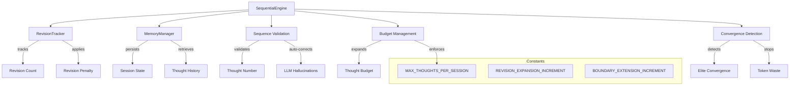

# How Sequential Thinking Works

The Sequential Engine is the backbone of CCT's cognitive timeline, controlling the flow of time, thought limits, and branching logic. This guide explains how CCT manages the progression of reasoning through disciplined sequence control.

## Overview

CCT's `SequentialEngine` implements the "Guardian of Order" for cognitive sessions, ensuring:
- **Sequence Validation**: Auto-corrects LLM hallucinations about position in the sequence
- **Budget Management**: Dynamic expansion of thought limits with revision penalties
- **Branching Support**: Tree of Thoughts exploration with branch validation
- **Early Convergence Detection**: Saves tokens by stopping when elite coherence is achieved
- **Flood Control**: Per-session thought limits prevent runaway token consumption

## Architecture



## Core Components

### SequentialEngine

**Location**: `src/engines/sequential/engine.py` (lines 78-295)

The `SequentialEngine` controls the temporal flow of cognitive sessions.

**Key Responsibilities:**
- Sequence validation and auto-correction
- Dynamic budget expansion
- Branch validation
- Convergence detection
- Flood control enforcement

### RevisionTracker

**Location**: `src/engines/sequential/engine.py` (lines 17-75)

The `RevisionTracker` implements the "Revision Penalty" concept from CCT v5.0.

**Purpose:**
- Track revision count per session for budget management
- Apply budget penalties for each revision
- Provide audit trail of revision activity

**Revision Penalty System:**
```python
# Each revision costs +2 to the budget
REVISION_EXPANSION_INCREMENT = 2

# When a revision occurs:
revision_count = revision_tracker.record_revision(session_id)
# This adds REVISION_EXPANSION_INCREMENT to the total thought budget
```

**Statistics Tracking:**
```python
stats = revision_tracker.get_stats()
# Returns:
# {
#     "tracked_sessions": 5,
#     "total_revisions": 12,
#     "total_penalty_steps": 24,
#     "avg_revisions_per_session": 2.4,
#     "session_breakdown": {
#         "session_abc123": {"revisions": 3, "penalty": 6},
#         ...
#     }
# }
```

## Sequence Processing

### Process Sequence Step

The `process_sequence_step` method is the core sequence control function:

```python
context = sequential_engine.process_sequence_step(
    session_id="session_abc123",
    llm_thought_number=5,
    llm_estimated_total=10,
    next_thought_needed=True,
    is_revision=False,
    revises_id=None,
    branch_from_id=None,
    branch_id=None
)
```

**Step 1: Sequence Validation**
```python
expected_thought_number = session.current_thought_number + 1

if llm_thought_number != expected_thought_number:
    logger.warning(f"LLM Sequence Hallucination. Expected {expected_thought_number}. Auto-correcting.")
    validated_thought_number = expected_thought_number
```

The engine auto-corrects when the LLM hallucinates its position in the sequence. The SQLite state is always the Single Source of Truth.

**Step 2: Dynamic Expansion Logic**
```python
validated_total = max(session.estimated_total_thoughts, llm_estimated_total)

if is_revision:
    # Apply revision penalty
    revision_tracker.record_revision(session_id)
    validated_total += REVISION_EXPANSION_INCREMENT  # +2 steps penalty

if next_thought_needed and validated_thought_number >= validated_total:
    validated_total = validated_thought_number + 1  # Boundary extension
```

The budget dynamically expands based on:
- LLM's estimate of total thoughts needed
- Revision penalties (each revision costs +2 steps)
- Boundary extension when reaching the limit

**Step 3: Branching Validation**
```python
if branch_from_id:
    parent_thought = memory_manager.get_thought(branch_from_id)
    if not parent_thought:
        branch_from_id = None  # Invalid branch, clear it
    else:
        logger.info(f"Branching detected. Diverging from node {branch_from_id} into '{branch_id}'.")
```

Branch operations are validated to ensure the parent thought exists before allowing divergence.

**Step 4: Session Persistence**
```python
# CRITICAL: Save mutated session back to SQLite
memory_manager.update_session(session)
```

Every sequence step updates the session state atomically to ensure consistency.

## Budget Management

### Constants

**Location**: `src/core/constants.py`

```python
MAX_THOUGHTS_PER_SESSION = 200  # Hard flood control limit
REVISION_EXPANSION_INCREMENT = 2  # Steps added per revision
BOUNDARY_EXTENSION_INCREMENT = 1  # Steps added when reaching boundary
```

### Extend Budget

Manual budget extension for exceptional cases:

```python
result = sequential_engine.extend_budget(
    session_id="session_abc123",
    additional_steps=10,
    reason="Complex architectural decision requires deeper analysis"
)

# Returns:
# {
#     "success": True,
#     "session_id": "session_abc123",
#     "previous_total": 10,
#     "new_total": 20,
#     "extension": 10,
#     "reason": "Complex architectural decision requires deeper analysis",
#     "revision_count": 2,
#     "revision_penalty": 4
# }
```

**Hard Limit Enforcement:**
```python
if new_total > MAX_THOUGHTS_PER_SESSION:
    return {
        "success": False,
        "error": f"Extension would exceed maximum ({MAX_THOUGHTS_PER_SESSION})",
        "maximum": MAX_THOUGHTS_PER_SESSION
    }
```

### Budget Information

Get comprehensive budget status:

```python
budget_info = sequential_engine.get_session_budget_info("session_abc123")

# Returns:
# {
#     "session_id": "session_abc123",
#     "current_thought": 8,
#     "estimated_total": 12,
#     "remaining": 4,
#     "utilization_percent": 66.7,
#     "revision_count": 2,
#     "revision_penalty_steps": 4,
#     "is_extended": True,
#     "status": "warning"  # "ok", "warning", or "critical"
# }
```

## Convergence Detection

### Early Convergence Detection

The `evaluate_convergence` method implements elite convergence detection to save tokens:

```python
result = sequential_engine.evaluate_convergence(
    session_id="session_abc123",
    next_thought_needed=False,
    metrics={
        "logical_coherence": 0.96,
        "evidence_strength": 0.85
    }
)
```

**Elite Convergence Criteria:**
```python
# High bar for convergence
coherence >= 0.95 AND evidence_strength >= 0.8

if coherence >= 0.95 and evidence >= 0.8:
    logger.info("Early Convergence detected")
    session.status = SessionStatus.COMPLETED
    return {
        "is_ready": True,
        "reason": "Elite convergence achieved (Metacognitive Audit success).",
        "early_stop": True
    }
```

**Minimum Depth Requirement:**
```python
minimum_depth = 3
if len(session.history_ids) < minimum_depth:
    return {"is_ready": False, "reason": "Minimum cognitive depth (3 steps) not reached."}
```

**Human Decision Check:**
```python
if session.requires_human_decision:
    return {"is_ready": False, "reason": "Awaiting human architectural decision."}
```

## Flood Control

### Per-Session Thought Limit

**Security Enforcement:**
```python
if session.current_thought_number >= MAX_THOUGHTS_PER_SESSION:
    raise PermissionError(
        f"[SECURITY] Session '{session_id}' has reached the maximum thought limit "
        f"({MAX_THOUGHTS_PER_SESSION}). Start a new session to continue."
    )
```

This prevents runaway token consumption from infinite loops or stuck sessions.

## Sequence Prompt Formatting

The engine provides formatted prompts to guide the LLM:

```python
prompt = sequential_engine.format_sequence_prompt("session_abc123")

# Returns:
# "[SYSTEM STATE] You are currently on Thought 5 of an estimated 10. Please structure your next JSON output accordingly."
```

This keeps the LLM aware of its position in the sequence.

## Branching Support

### Branch Validation

When branching from an existing thought:

```python
context = sequential_engine.process_sequence_step(
    session_id="session_abc123",
    llm_thought_number=5,
    llm_estimated_total=10,
    next_thought_needed=True,
    branch_from_id="thought_xyz",  # Parent thought ID
    branch_id="branch_abc"  # New branch ID
)
```

The engine validates that the parent thought exists before allowing the branch.

## Integration Points

**With CognitiveOrchestrator:**
```python
# Orchestrator uses SequentialEngine for sequence control
context = sequential_engine.process_sequence_step(session_id, ...)
convergence = sequential_engine.evaluate_convergence(session_id, ...)
```

**With MemoryManager:**
```python
# SequentialEngine persists session state
memory_manager.update_session(session)

# Retrieves session state
session = memory_manager.get_session(session_id)

# Validates parent thoughts for branching
parent = memory_manager.get_thought(branch_from_id)
```

**With DynamicPrimitiveEngine:**
```python
# Primitives receive sequential context
context = SequentialContext(
    thought_number=validated_thought_number,
    estimated_total_thoughts=validated_total,
    is_revision=is_revision,
    branch_from_id=branch_from_id,
    branch_id=branch_id
)
```

## Performance Characteristics

**Auto-Correction Overhead:**
- Minimal overhead for sequence validation
- Only triggers when LLM hallucinates position
- SQLite state is always the Single Source of Truth

**Budget Management:**
- Dynamic expansion prevents premature termination
- Revision penalties discourage excessive rethinking
- Hard limits prevent runaway consumption

**Convergence Detection:**
- Early stopping saves significant tokens
- Elite thresholds ensure quality isn't sacrificed
- Minimum depth ensures sufficient reasoning

## Code References

- **SequentialEngine**: `src/engines/sequential/engine.py` (lines 78-295)
- **RevisionTracker**: `src/engines/sequential/engine.py` (lines 17-75)
- **Constants**: `src/core/constants.py`
- **SessionStatus Enum**: `src/core/models/enums.py` (lines 93-99)

## Whitepaper Reference

This documentation expands on **Section 4: The Engine of Time** of the main whitepaper, providing technical implementation details for the concepts described there.

---

*See Also:*
- [How Memory Works](./how-memory-works.md)
- [How Primitives Thinking Engine Works](./how-primitives-thinking-engine-works.md)
- [Main Whitepaper](../whitepaper.md)
