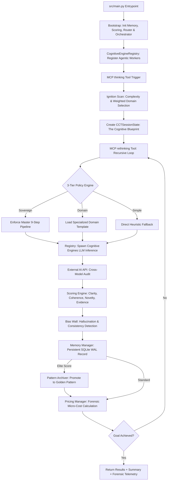

# CCT as a Cognitive Exocortex: The Framework of Sovereign Intelligence

This document defines the conceptual and technical bridge between raw Large Language Models (LLMs) and **Sovereign Cognitive Systems**. It explains how the CCT MCP Server acts as an **Exocortex**—an external layer of discipline, memory, and auditing that transforms AI from a "text predictor" into a "systemic thinker."

---

## 1. The Exocortex Paradigm: C&C for Sovereign Intelligence

In cognitive architecture, Large Language Models (LLMs) often function as "Headless Context"—they possess vast knowledge but lack the **Executive Function** to manage their own reasoning. Scientifically, LLMs operate by default on "System 1" (fast, intuitive thinking).

**CCT (Creative Critical Thinking)** serves as the AI's **External Prefrontal Cortex (Exocortex)**. CCT wraps the base inference engine with a layer of "System 2" cognition—slow, deliberative, and disciplined—transforming the AI from a simple text generator into a **Self-Improving Cognitive Engine**.

### A. The "Digital Twin" & Command & Control (C&C) Concept
CCT is designed as a "Digital Twin" for a Senior Systems Architect. In the context of **Command & Control**, CCT ensures that every human intent is not executed blindly but filtered through strict cognitive protocols:
-   **Discipline (Pipelines)**: Forcing the AI to undergo empirical research and simulation before decision-making.
-   **Auditing (Scoring)**: Quantitatively measuring the quality of every thought step.
-   **Sovereignty (Autonomy)**: Enabling the AI to perform internal audits and adversarial simulations independently.

### B. The Autonomous-First Doctrine
The core pillar of CCT is high-velocity efficiency without compromising security. Therefore, CCT operates in **Autonomous Mode by default**.
-   **Internal Clearance**: The AI instantiates a Veteran Architect persona (25+ years experience) to audit its own output. If logic and consistency scores meet defined thresholds, the AI grants itself "Internal Clearance" to proceed to implementation.
-   **Human-in-the-Loop (The Human Stop)**: Manual-Clearance mode is only explicitly triggered for **mission-critical** tasks (e.g., core security infrastructure). In these scenarios, CCT performs a **Human Stop**, presenting its internal debates and empirical data to the human user before requesting execution authority.

### C. Strategic Human Assistance
CCT shifts the paradigm of AI assistance from a "helper" to a "cognitive partner." Through the Digital Hippocampus, your AI doesn't just assist with typing—it actually **learns your architectural style**. This is vital for maintaining a "High-Bar Engineering" standard as project complexity scales.

### D. The Identity Layer: Digital Symbiosis
A Sovereign Intelligence must reflect the architectural DNA of its master. CCT integrates an explicit **Identity Layer** injected at **Phase 0 (Ignition)**, serving as the cognitive foundation for all subsequent reasoning.

#### 1. The Dual Components of Identity
-   **USER_MINDSET (The Architect's DNA)**: Defines the structural philosophy, coding standards (e.g., Domain-Driven Design), and architectural "allergies" of the user. This ensures the AI's creativity is bounded by the user's elite standards.
-   **CCT_SOUL (The Digital Twin Persona)**: Dictates the tone, rules of engagement, and internal debating standards of the AI. It transforms the "Critic" in the Actor-Critic loop from a generic auditor into an uncompromising reflection of the user's own critical thinking.

#### 2. The "Lazy Failover" Protocol (UX Hardening)
To ensure the system is always "Sovereign" even without manual configuration, CCT implements a three-tier failover mechanism:
1.  **Zero-Config Provisioning (Auto-Seeding)**: Upon server initialization, CCT checks for the existence of `configs/identity/`. If files are missing, it automatically generates high-fidelity `mindset.md` and `soul.md` files seeded with **"Sovereign Defaults"** (Principal Architect standards).
2.  **Hardcoded DNA (Evolutionary Memory)**: If the file system is read-only or writing fails, CCT falls back to hardcoded internal constants. The "Architect's DNA" is never lost; it is hardwired into the engine's core.
3.  **Low Effort, High Impact**: Users get "Elite-Grade" engineering standards out-of-the-box. The Identity Layer is active from the first second, allowing users to fine-tune it only when they are ready.

#### 3. Mechanical Implementation: System Prompt Decoration
The Identity Layer is not merely "told" once. It is enforced through a **Railway Decoration Pattern**:
-   **Contextual Prepending**: For every atomic or hybrid thought step, the engine prepends the `CCT_SOUL` and `USER_MINDSET` to the system prompt.
-   **Cognitive Rails**: This ensures that every LLM call is bounded by the same identity, preventing "Character Drift" or the loss of architectural discipline during long-running sessions.
---

## 2. The Taxonomy of Thinking (Modes)

CCT categorizes knowledge processing into two distinct levels, found in `src/modes/`:

### A. The Atomic Workers: Primitives (`src/modes/primitives/`)
In the CCT architecture, **Primitives** are the "Atomic Workers" of the engine. Every primitive operation is processed by the `DynamicPrimitiveEngine`, a unified factory that maintains a strict architectural contract for all base reasoning tasks.

#### The Atomic Processing Lifecycle
When a task is routed to a Primitive, it undergoes a 4-stage technical lifecycle:
1.  **Contextual Injection**: The worker retrieves state from the `SequentialEngine`, ensuring it understands its position in the branching "Tree of Thought."
2.  **Hardened Validation**: Every thought is immediately audited by the `ScoringEngine`. It receives quantitative scores for **Clarity, Coherence, Novelty,** and **Evidence**.
3.  **Cognitive Evolution**: Using the `PatternArchiver`, the system automatically promotes thoughts with elite `logical_coherence` (> 0.9) to **Golden Thinking Patterns**, persisting them in the memory bank for future sessions.
4.  **Early Convergence**: If a primitive worker detects a "Breakthrough" thought that meets victory conditions, it triggers **Early Convergence Detection** to stop overthinking and save tokens.

#### The Primitive Taxonomy (`src/core/models/enums.py`)
The system supports a vast catalog of specialized atomic logic, categorized as:
-   **Functional Workers**: `Linear`, `Systematic`, `Critical`, `Dialectical`, `Analytical`.
-   **Advanced Workers**: `First Principles`, `Abductive`, `Empirical Research`, `Counterfactual`.
-   **Agentic Workers**: `ReAct`, `Plan-and-Execute`, `Tree of Thoughts`, `REWOO`.
-   **Strategic Workers**: `SWOT Analysis`, `Second Order Thinking`, `First Principles Econ`.

### B. The Cognitive Molecules: Hybrids (`src/modes/hybrids/`)
**Hybrids** are complex reasoning structures that combine multiple primitives into a synchronized cognitive cycle. Unlike standard AI that tries to be "everything at once," CCT hybrids enforce a **Division of Labor** between different cognitive tasks.

#### The Dual-Layer Adversarial Loop (Actor-Critic)
In standard LLM architectures, an AI acting as its own critic suffers from **"Sycophancy Bias"**—the inherent tendency of neural weights to agree with their own generated proposals. The `ActorCriticEngine` mitigates this through a dual-method auditing strategy:

1.  **The Gold Standard: External Cross-Model Audit** (Recommended)
    To achieve architectural perfection, users are strongly encouraged to integrate an external API (e.g., GPT-4o, DeepSeek, or a specialized Local LLM) to act as the **Critic**. By routing the objective critique to a separate model architecture, CCT creates a **True Adversarial Network**. 
    *   **Benefit**: This eliminates the "Echo Chamber" effect and subject's the proposal to a completely different set of weights and biases.

2.  **The Baseline: Internal Persona-Based Simulation** (Fallback Mode)
    If no external API is configured, the engine performs a high-fidelity internal simulation. The primary model is forced into a **Metacognitive Split**, instantiating a ruthless "Security Auditor" persona explicitly prompted to destroy the proposal's logic.
    *   **Implication**: While this mode is highly effective for rapid iteration, it remains technically susceptible to subtle architectural sycophancy. It serves as a powerful baseline but lacks the "Hardened Sovereignty" of the cross-model approach.

#### Multi-Domain Review (Council of Critics)
The `MultiAgentFusionEngine` simulates a "Cognitive War Room". It injects diverse expert insights (Divergent Phase) and then merges them using the `FusionOrchestrator` (Convergent Phase) to arrive at a holistic decision.

#### Strategic & Temporal Projection
-   **Temporal Horizon**: Forces a 3-tier timeline projection: **NOW** (Implementation), **NEXT** (Scale), and **LATER** (Long-term Debt).
-   **Lateral Logic**: Triggers "Unconventional Pivots" when the scoring engine detects a logic plateau, forcing the AI to break its current paradigm.

---

## 3. The Intelligence Router & Pipeline Engine

The Exocortex does not use a "one-size-fits-all" approach to reasoning. Instead, it employs a sophisticated **Intelligence Router** that calculates the optimal cognitive path for every query. This process ensures that a simple task isn't overthought (wasting tokens) and a complex architectural problem isn't under-processed.

### A. Phase 1: Lexical Ignition & Weighted Discovery (`src/utils/pipelines.py`)
Upon receiving a `problem_statement`, the system initiates an **Ignition Scan**. This is a two-pronged analysis performed by the `ComplexityService` and the `PipelineSelector`:
-   **Weighted Category Detection**: The system runs a lexical scan against 7 core domains (ARCH, SEC, DEBUG, FEAT, BIZ, PLAN, ENGINEERING). 
-   **Logarithmic Scoring Boost**: Category scores are calculated using a weighted algorithm (`0.3 + matches * 0.15`), capped at `1.0`. This ensures that multiple technical keywords consolidate the system's confidence in a specific reasoning path.
-   **Scenario Mapping**: The router generates a **Weighted Scenario Map** (e.g., `{'ARCH': 0.8, 'SEC': 0.4}`). This allows CCT to recognize hybrid problems and dynamically adjust the "Multi-Agent" persona mix.

### B. Phase 2: The Cognitive Blueprint (`src/core/models/domain.py`)
The results of the Ignition Scan are persisted into the `CCTSessionState` as a **Cognitive Blueprint**. This ensures session consistency across multiple `rethinking` calls.
-   **`primary_category`**: The dominant domain used to select the initial strategy template.
-   **`suggested_pipeline`**: The pre-calculated list of `ThinkingStrategy` enums specifically tailored for the detected domain.

### C. The Deep Reasoning Catalog (Thinking Steps)
CCT maintains a library of specialized thinking sequences. Each sequence is designed to maximize the "Cognitive ROI" for its specific domain:

| Pipeline | Core Thinking Steps & Logic |
| :--- | :--- |
| **`DEBUG`** | `Self-Debugging` → `Empirical Research` → `Abductive` → `First Principles` → `Actor-Critic` |
| **`ARCH`** | `Brainstorming` → `Engineering Deconstruction` → `First Principles` → `Systemic` → `Council of Critics` |
| **`SEC`** | `Critical` → `Actor-Critic Loop` → `Systemic` → `Post-Mission Learning` |
| **`FEAT`** | `Brainstorming` → `Deconstruction` → `Systematic` → `Actor-Critic` → `Post-Mission` |
| **`BIZ`** | `SWOT Analysis` → `Second Order Thinking` → `Long-Term Horizon` → `Post-Mission` |
| **`PLAN`** | `Plan-and-Execute` → `ReAct` → `Tree of Thoughts` → `Post-Mission` (Agentic Focus) |
| **`ENGINEERING`** | `Brainstorming` → `Deconstruction` → `Systemic` → `Deductive Validation` → `Learning` |

### D. Automated Strategy Routing & The 3-Tiered Hierarchy (`router.py`)
The Exocortex uses a tiered policy hierarchy to determine the next strategy in the sequence:

1.  **Tier 1: Sovereign Force (Deep Reasoning)**: If the task is flagged as `COMPLEX` or `SOVEREIGN`, the system enforces the **Master 9-Step Pipeline** regardless of the domain. This ensures maximum architectural hardening and adversarial review for high-stakes missions.
2.  **Tier 2: Domain Templates**: If the task is moderately complex, the `primary_category` fetches a specialized sequence (e.g., `ARCH` triggers *Engineering Deconstruction* and *Council of Critics*). This provides domain-specific expertise while maintaining operational efficiency.
3.  **Tier 3: Heuristic Fallback**: For generic or simple tasks, the engine uses hardcoded, low-overhead fallback sequences (e.g., `LINEAR` → `ANALYTICAL`). This prevents the AI from "over-thinking" and wasting token budget on trivial queries.

### E. Neural Recalculation & Dynamic Pivoting
Beyond the initial blueprint, the router continuously monitors the mission's quality using real-time feedback:
-   **Dynamic Pivoting**: If the `ScoringEngine` detects a quality drop (Clarity or Coherence scores falling below thresholds), the router triggers an `UNCONVENTIONAL_PIVOT`. This breaks the planned sequence, forcing the AI to re-evaluate the problem from a lateral perspective.
-   **Convergence Discovery**: The system automatically terminates the thinking sequence when it detects high-density "Persona Insights" and an evidence strength score `> 0.8`. This ensures a clean transition from reasoning to implementation.

### F. The Sovereign 9-Step Pipeline
The **Master Deep Reasoning Sequence** represents the gold standard of architectural hardening:
1.  **Empirical Research** (Fact Gathering)
2.  **First Principles** (Assumption Deconstruction)
3.  **Actor-Critic Loop** (Internal Adversarial Debate)
4.  **Council of Critics** (Multi-Domain Persona Review)
5.  **Systemic Thinking** (Holistic Connectivity)
6.  **Unconventional Pivot** (Paradigm-Breaking Lateral Shift)
7.  **Long-Term Horizon** (NOW/NEXT/LATER Strategic Audit)
8.  **Multi-Agent Fusion** (Final Dialectical Synthesis)
9.  **Post-Mission Learning** (Pattern Promotion to Memory)

---

## 4. The Engine of Time: Sequences, Branches, and Calculation (`src/engines/sequential/engine.py`)

CCT does not just record thoughts; it manages the **Cognitive Timeline**. The `SequentialEngine` acts as the "Guardian of Order," ensuring that the progression of reasoning follows a logical and verifiable sequence.

### A. Chain of Thought (CoT): Linear Discipline
The Exocortex enforces a strict linear progression for standard reasoning arcs.
-   **Ground Truth Correction**: If an LLM "hallucinates" its position in the sequence (e.g., claiming it is on Thought #5 when memory shows Thought #3), the `SequentialEngine` auto-corrects the sequence. The system's SQLite state is always the **Single Source of Truth**.
-   **Thought Number Calculus**: Every thought is issued a `thought_number` verified against the `CCTSessionState`. This prevents skipping steps or losing context in complex multi-turn exchanges.

### B. Tree of Thoughts (ToT): The Branching Architecture
Beyond linear chains, CCT supports non-linear reasoning through architectural branching.
-   **Node-Link Structure**: Every `EnhancedThought` contains a `parent_id` and `children_ids`. This transforms a flat list of steps into a **Cognitive Map** (The Thought Tree).
-   **The `branch_from_id` Protocol**: When the `LateralEngine` or a user-initiated branch occurs, the system validates the existence of the "Ancestor Node" before spawning a new timeline. This enables **Parallel Hypothesis Testing** without losing the original logic path.

### C. Dynamic Expansion Logic
The CCT engine dynamically adapts the mission length based on the depth of the reasoning depth:
-   **Boundary Extension**: If the AI reaches the initial `estimated_total_thoughts` but the `next_thought_needed` flag is still active, the engine automatically extends the boundary to prevent premature cut-offs.
-   - **The Revision Penalty (+2)**: When a `is_revision` event occurs (e.g., correcting an error or pivoting paradigm), the engine automatically adds **+2 steps** to the architectural budget. This ensures the AI has enough "Timeline Depth" to resolve the new path.

### D. Mission Guardrails
To prevent infinite reasoning loops or massive token leaks, the `SequentialEngine` enforces a hard **Flood Control Limit** (`MAX_THOUGHTS_PER_SESSION`). Once reached, the mission is forcefully concluded, requiring a new session for further exploration.

---

## 5. The Digital Hippocampus: Persistence & Cognitive Evolution (`src/engines/memory/`)

In standard LLM architectures, cognition is ephemeral; memory is lost the moment a session concludes. CCT transforms this limitation through the **Digital Hippocampus**—a persistent, secure, and evolving memory engine that allows the AI to develop independent "Institutional Knowledge."

### A. The Architecture of Cognitive Persistence (The Memory Vault)
The Digital Hippocampus is built on a high-concurrency **SQLite** backbone utilizing the **Document Store Pattern**. Data integrity is guaranteed via:
-   **High-Concurrency Async Access**: By enabling **WAL (Write-Ahead Logging)** mode and implementing a global `threading.Lock`, the system handles simultaneous asynchronous read/write operations from FastMCP tool handlers without the risk of *Database Locked* errors. This is a prerequisite for an Exocortex operating in real-time.
-   **The Indexed Document Store**: Data is not stored in rigid relational tables but as highly flexible JSON blobs that remain performantly indexed (e.g., `idx_thoughts_session`, `idx_patterns_usage`). This enables complex cognitive pattern retrieval in milliseconds.

### B. Cognitive Sovereignty: Security at the Thought Layer
As an Exocortex, CCT must safeguard the **Cognitive Sovereignty** of its user. Memory must never leak or be accessed by unauthorized entities.
-   **Bearer Token Security Model**: Every cognitive mission is issued a `session_token` (32-byte cryptographically random, via `secrets.token_urlsafe`). This token acts as a "Cognitive Identity" that must be provided to access *Episodic Memory* (thought history).
-   **Resilience Against Timing Attacks**: Token verification is performed using `secrets.compare_digest`. Scientifically, this prevents *side-channel attacks* that attempt to guess cognitive identities based on server response latency.

### C. Procedural Memory: The Learning Loop (LTP Analogy)
CCT adopts the biological concept of **Long-Term Potentiation (LTP)**—where neural pathways that are frequently used become stronger.
1.  **Golden Thinking Patterns**: Every thought that receives an elite score from the `ScoringEngine` is promoted to the global `thinking_patterns` table. Each pattern is tracked with a `usage_count`; the more a pattern is validated and reused, the higher its authority in guiding the AI in future missions.
2.  **The Cognitive Immune Wall (Anti-Patterns)**: CCT is the only system that archives "failures" in a structured manner. By storing `AntiPattern` data (deadlocks, biases, or qualitative errors) along with their **Corrective Actions**, the engine builds a cognitive immune system that prevents the AI from "falling into the same pit" twice.

### D. Intelligent Recall: Phase 0 Awareness
Before a new cognitive mission begins, the Hippocampus performs a **Lexical Recall Phase**. The system scans the repositories for past cognitive patterns relevant to the current `problem_statement`.
-   **Expert Reflexes**: Recall results are injected directly as *Phase 0 Context*, providing the AI with "expert reflexes" before it even executes its first thinking step. This distinguishes CCT from traditional RAG systems because it remembers not just data, but **methods of reasoning**.

### E. Forensic Trail & Accountability
Every critical write operation to memory triggers a structured JSON entry to the `audit_logger`. This creates a **Cognitive Black Box** that can be forensically audited, ensuring every evolutionary step of the AI remains transparent and within the safety boundaries defined by the human user.

---

## 6. The Brain's Auditor: Metacognitive Analysis & Quality Assurance (`src/analysis/`)

CCT integrates a dedicated **Quality Assurance (QA) Engine** that acts as the "Internal Auditor" of the AI's thoughts. This layer moves the system from biased, intuitive reactions (System 1) to audited, metacognitive reasoning (System 2).

### A. The Scoring Engine: Metacognitive Monitoring (`scoring_engine.py`)
Every thought node is subjected to a **4-Vector Metric Analysis** by the `ScoringEngine`.
1.  **Clarity Score**: Measures the precision and syntactic quality of the expression.
2.  **Logical Coherence**: Evaluates the alignment with the parent thought. 
    -   **The Redundancy Trap**: If coherence is too high (>0.9), the system penalizes the score, identifying it as a "Cognitive Loop" where the AI is merely repeating itself.
3.  **Novelty Detection**: Compares the current thought against a sample of the mission history to ensure active exploration of the problem space.
4.  **Evidence Strength**: Scans for grounding markers (e.g., "code snippets," "empirical data," "logical proofs") to ensure the thought is anchored in reality.

### B. Cognitive Bias Mitigation (The Bias Wall)
LLMs are inherently prone to systemic biases. CCT mitigates this through the `IncrementalSessionAnalyzer`:
-   **Bias Flagging**: The system identifies hallucination markers and linguistic biases (e.g., "over-confident assertions" without evidence) and flags them in the session telemetry.
-   **Adversarial Correction**: High bias flags trigger the **Actor-Critic Hybrid**, forcing a revision of the thought from an adversarial perspective to "wash out" the bias.

### C. Recursive Memory Compression (Summarization)
To prevent the "Context Window Wall," CCT utilizes a **Recursive Summarization Strategy** (`summarization.py`).
-   **Cognitive Distillation**: Older thoughts are not simply deleted; they are "Digested" into high-density insights. This allows the AI to maintain its "Long-term Intuition" of the project while keeping the active token window focused on the current problem.

### D. Early Convergence: The Efficiency Guardrail
The Auditor monitor's the session's overall progress. If the `logical_coherence` of a thought reaches 0.95+ early in a sequence—indicating the problem has been solved with high precision—the engine triggers **Early Convergence Detection**. This halts the thinking sequence and moves directly to implementation, saving the user significant token costs.

---

## 7. The Financial Conscience: Cognitive Economics & Forensic Auditing (`src/utils/pricing.py`)

Intelligence costs money. In the CCT ecosystem, an AI that is unaware of its own operational cost is considered an architectural risk. CCT implements a **Financial Conscience**—a layer of the Exocortex dedicated to the discipline of **Cognitive Economics**.

### A. The Doctrine of Cognitive Economics
Scientifically, cognitive depth is a finite resource governed by the cost of compute. CCT treats "Tokens" as the currency of intelligence.
-   **Resource Awareness**: By tracking every cent spent on a thought, CCT ensures the user maintains **Financial Sovereignty**. If the AI cannot predict or report its "Burn Rate," it cannot be safely delegated high-stakes, autonomous reasoning.
-   **Burn Rate Optimization**: The system allows for a "Pessimistic" view of costs, encouraging the AI to find the most efficient cognitive path without sacrificing quality.

### B. The Digital Auditor: Precision Pricing & Forex
The `PricingManager` acts as an automated auditor that synchronization disparate billing datasets with real-world financial metrics.
-   **Dynamic Forex Synchronization (`ForexService`)**: CCT does not rely on static exchange rates. It utilizes a **Cache-Aside Strategy** to fetch live USD/IDR rates from the Frankfurter API with a 24-hour TTL. If external APIs fail, it falls back to a defensive baseline (`17095.0`), ensuring mathematical continuity in all environments.
-   **Model Family Normalization**: Model identifiers can be inconsistent. The `PricingManager` performs **Heuristic Normalization**—mapping semantic aliases (e.g., `claude-3.5`) to their canonical "Source of Truth" pricing datasets in `database/datasets/`.

### C. Asymmetric Model Routing (Cost-Optimized Debates)
Cross-model auditing introduces potential API costs. To maintain strict cognitive economics, the `PricingManager` works in tandem with the intelligence router to perform **Asymmetric Routing**. 
-   **Strategic Worker Offloading**: Heavy brainstorming or initial critic roles can be dynamically routed to high-speed, lower-cost models (e.g., Local Ollama models or Groq endpoints).
-   **Elite Synthesis**: Final architectural clearance and multi-agent synthesis are reserved for premium flagship models. This achieves multi-agent adversarial hardening without a linear increase in token burn rate.

### D. The Pessimistic Fallback: Defensive Economy
A core tenet of CCT is **Financial Safety First**. If the system encounters an unknown model or a missing pricing dataset, it triggers the **Pessimistic Fallback Protocol**.
-   **Premium Averaging (`ai-common-model`)**: Instead of under-estimating, the system assumes a "Premium Average" (historically set at $6.15/$45.40 per 1M tokens). This defensive over-estimation prevents "Billing Surprises," ensuring the user is always prepared for the worst-case scenario.

### E. Telemetry Forcing: The Forensic Trail
Transparency is non-negotiable for a Sovereign AI. CCT enforces a **Telemetry Forcing Doctrine**:
-   **Mandatory Model Identity**: Every tool call (`thinking`, `rethinking`) must report its `llm_model_name`. This allows for precise, forensic attribution of costs to specific reasoning steps.
-   **Micro-Cost Transparency**: Costs are calculated with 10-decimal precision (USD) and 5-decimal precision (IDR). This data is persisted alongside the thought node, creating a permanent, auditable ledger of the mission's financial footprint.

---

## 8. The Sovereign Cognitive Loop: System Workflow & Algorithm

The CCT engine operates as a closed-loop system, transforming high-level human intent into verifiable architectural results through a series of disciplined phases. The following diagram and trace describe the technical lifecycle of a cognitive mission from initialization to forensic closure.

### A. Architectural Workflow Diagram

### B. The 6-Step Algorithmic Trace

#### 1. Zero-State Bootstrap
The mission begins at the `main.py` entrypoint. The system performs dependency injection, establishing the "Cognitive Bones": initializing high-concurrency **SQLite (WAL mode)**, syncing with **Forex APIs** for pricing precision, and registering the library of Atomic Workers and Hybrid Molecules.

#### 2. The Ignition Scan (Discovery)
Upon receiving the `problem_statement`, the system ignores the impulse for immediate reaction. Instead, it runs an **Ignition Scan**. The `ComplexityService` determines the mission length, while the `PipelineSelector` executes a weighted lexical scan to "discover" the strategic domain (e.g., ARCH, SEC, or DEBUG).

#### 3. The 3-Tiered Policy Routing
The `AutomaticPipelineRouter` enforces the **Sovereign Hierarchy**. Deep architectural threats are forced into the **9-Step Master Sequence**, while routine engineering tasks follow domain-specific templates. Simple queries bypass complexity entirely via a cost-saving **Heuristic Fallback**, ensuring the system never over-processes trivial data.

#### 4. The Metacognitive Audit & Bias Wall
As the `rethinking` loop executes, every thought is forensically audited by the **Brain's Auditor**. The `ScoringEngine` calculates 4D metrics while the `Bias Wall` monitors for hallucination flags. If quality drops, the router triggers an `UNCONVENTIONAL_PIVOT`, breaking the current sequence to find a new logical path.

#### 5. Persistence & Long-Term Potentiation (LTP)
Thought data is committed to the **Digital Hippocampus**. If a reasoning step achieves "Elite" status (Clarity/Coherence > 0.9), the `PatternArchiver` promotes it to a **Golden Thinking Pattern**. This creates a permanent evolutionary leap, ensuring the "Digital Twin" becomes more efficient in every subsequent session.

#### 6. Forensic Closure & Telemetry Return
Once convergence markers are met (Conclusion detected + Evidence > 0.8), the mission concludes. The `PricingManager` performs a final micro-cost audit (USD/IDR). The user receives the final result accompanied by a **Forensic Ledger**, ensuring 100% financial and cognitive accountability.

---

## 9. Author & Visionary

**Steeven Andrian Salim**  
*Principal Systems Architect & Cybersecurity Expert*

Steeven is a veteran in systems architecture, software engineering, and digital forensics with a deep focus on building sovereign, mission-critical infrastructure. As the primary architect and creator of the **Creative Critical Thinking (CCT) Framework**, he is dedicated to evolving AI agents from stateless text-generators into high-discipline **"Digital Twins"** for engineering leaders. His work focuses on the intersection of cognitive sovereignty, adversarial hardening, and autonomous enterprise-grade orchestration.

> "Intelligence without discipline is just noise; a sovereign AI must be audited by its own metacognition before it is granted the authority to act."

---

### Technical Summary: Single Source of Truth
- **Registry**: `src/modes/registry.py`
- **Orchestration**: `src/engines/orchestrator.py`
- **Scoring**: `src/analysis/scoring_engine.py`
- **Routing**: `src/utils/pipelines.py`

*CCT Whitepaper v5.0 — Hardened for Sovereign Intelligence.*
