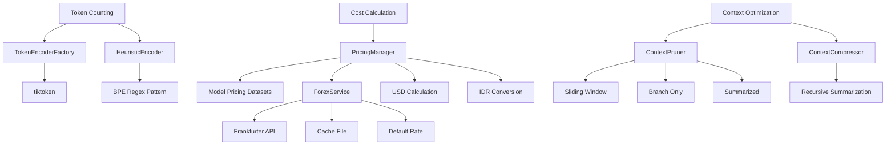

# How Tokens and Costs are Calculated

CCT's Financial Transparency Layer provides real-time tracking of your "Cognitive Investment" with high-precision token counting and cost calculation. This guide explains how CCT measures token usage and calculates costs with enterprise-grade accuracy.

## Overview

CCT's token and cost calculation system includes:
- **High-Precision Token Counting**: Tiktoken-based counting with heuristic fallback
- **Real-Time Cost Calculation**: USD calculation with 10-decimal precision
- **Live Forex Conversion**: Dynamic USD-to-IDR conversion with caching
- **Pessimistic Fallback**: Safe cost estimation for unknown models
- **Context Optimization**: Token budget management through pruning and compression

**Key Features:**
- **Model-Aware Encoding**: Different tokenizers for different models
- **Cache-Aside Strategy**: 24-hour forex rate caching
- **Family Mapping**: Robust model ID resolution
- **Token Economy**: Context pruning for cost optimization
- **Audit Trail**: Exact rate tracking for each calculation

## Architecture



## Core Components

### TokenEncoderFactory

**Location**: `src/utils/tokenizer.py` (lines 19-52)

The `TokenEncoderFactory` provides model-aware token encoders using tiktoken for OpenAI/Claude models and heuristic fallbacks for others.

**Implementation:**
```python
class TokenEncoderFactory:
    """
    Factory for model-aware token encoders.
    Provides tiktoken encoders for OpenAI/Claude and heuristic fallbacks for others.
    """
    _encoders: Dict[str, Any] = {}

    @classmethod
    def get_encoder(cls, model_id: str = "claude-3-5-sonnet-20240620"):
        """Gets or creates an encoder for the specified model."""
        if model_id in cls._encoders:
            return cls._encoders[model_id]

        encoder = None
        if HAS_TIKTOKEN:
            try:
                # Map common models to tiktoken encodings
                if "gpt-4o" in model_id:
                    encoder = tiktoken.get_encoding("o200k_base")
                elif "gpt-4" in model_id or "gpt-3.5" in model_id or "claude-3" in model_id:
                    encoder = tiktoken.get_encoding("cl100k_base")
                else:
                    encoder = tiktoken.get_encoding("cl100k_base")
            except Exception as e:
                logger.debug(f"Tiktoken failed to load encoder for {model_id}: {e}")

        if not encoder:
            encoder = HeuristicEncoder(model_id)

        cls._encoders[model_id] = encoder
        return encoder
```

**Model Mappings:**
- **GPT-4o**: `o200k_base` encoding
- **GPT-4/GPT-3.5/Claude-3**: `cl100k_base` encoding
- **Default**: `cl100k_base` (most common modern standard)

### HeuristicEncoder

**Location**: `src/utils/tokenizer.py` (lines 53-68)

Fallback encoder that uses a sophisticated regex to estimate tokens when tiktoken is unavailable.

**Implementation:**
```python
class HeuristicEncoder:
    """Fallback encoder that uses a sophisticated regex to estimate tokens."""
    def __init__(self, model_id: str):
        self.model_id = model_id

    def encode(self, text: str) -> List[int]:
        """Simple encoding mock returning dummy IDs based on regex matches."""
        matches = _HEURISTIC_BPE_PATTERN.findall(text)
        return [0] * len(matches)

    def count(self, text: str) -> int:
        """Efficiently count tokens without full list generation."""
        return len(_HEURISTIC_BPE_PATTERN.findall(text))
```

**BPE Pattern:**
```python
_HEURISTIC_BPE_PATTERN = re.compile(
    r"""'s|'t|'re|'ve|'m|'ll|'d| ?[a-zA-Z\d]+| ?[^\s\w]+|\s+(?!\S)|\s+""", 
    re.UNICODE
)
```

### PricingManager

**Location**: `src/utils/pricing.py` (lines 87-220)

The `PricingManager` manages model pricing datasets and calculates cognitive costs with pessimistic fallback logic.

**Cost Calculation:**
```python
def calculate_costs(
    self, 
    model_id: str, 
    input_tokens: int, 
    output_tokens: int
) -> Dict[str, float]:
    """
    Calculates granular costs in USD and IDR.
    Returns a dictionary with input, output, and total costs.
    """
    pricing = self._load_model_pricing(model_id)
    
    # Pessimistic fallback if specific model resolution fails
    if not pricing:
        logger.info(f"Using 'ai-common-model' fallback for: {model_id}")
        pricing = self._load_model_pricing("ai-common-model")
    
    # Support both per-1M schema (canonical) and legacy per-1K schema
    if pricing:
        if "input_price_per_1m" in pricing:
            rates["input_1k"] = pricing["input_price_per_1m"] / 1000.0
            rates["output_1k"] = pricing["output_price_per_1m"] / 1000.0
        elif "pricing" in pricing:
            p_data = pricing["pricing"]
            rates["input_1k"] = p_data.get("input_1k", 0.0)
            rates["output_1k"] = p_data.get("output_1k", 0.0)

    # Calculate USD (10 decimal precision for micro-costs)
    in_cost_usd = (input_tokens / 1000.0) * rates["input_1k"]
    out_cost_usd = (output_tokens / 1000.0) * rates["output_1k"]
    total_usd = in_cost_usd + out_cost_usd

    # Calculate IDR (Dynamic via Forex Service, 5 decimal precision)
    usd_to_idr = self.forex.get_usd_to_idr_rate()
    in_cost_idr = in_cost_usd * usd_to_idr
    out_cost_idr = out_cost_usd * usd_to_idr
    total_idr = in_cost_idr + out_cost_idr

    return {
        "input_usd": round(in_cost_usd, 10),
        "output_usd": round(out_cost_usd, 10),
        "total_usd": round(total_usd, 10),
        "input_idr": round(in_cost_idr, 5),
        "output_idr": round(out_cost_idr, 5),
        "total_idr": round(total_idr, 5),
        "currency_rate_idr": usd_to_idr  # Audit field
    }
```

### ForexService

**Location**: `src/utils/pricing.py` (lines 10-86)

The `ForexService` provides automated currency exchange rate fetching with persistent local caching.

**Cache-Aside Strategy:**
```python
def get_usd_to_idr_rate(self) -> float:
    """
    Retrieves the USD/IDR rate using a Cache-Aside strategy.
    Returns the latest rate from API, Cache, or safe Fallback.
    """
    # 1. Try to load from Cache
    cache_data = self._load_cache()
    if cache_data:
        timestamp = cache_data.get("timestamp", 0)
        # Check if cache is still fresh (24-hour TTL)
        if (time.time() - timestamp) < self.CACHE_TTL:
            logger.debug("Forex: Using fresh cached rate.")
            return cache_data.get("rate", self.DEFAULT_RATE)

    # 2. Cache is stale or missing -> Fetch from API
    try:
        logger.info("Forex: Fetching fresh rate from Frankfurter API...")
        response = requests.get(self.API_URL, timeout=5)
        response.raise_for_status()
        data = response.json()
        
        rate = data.get("rates", {}).get("IDR")
        if rate:
            self._save_cache(rate)
            return float(rate)
    except Exception as e:
        logger.error(f"Forex: API fetch failed: {e}")

    # 3. Fallback to Stale Cache or Default
    if cache_data:
        logger.warning("Forex: API failed, falling back to stale cached rate.")
        return cache_data.get("rate", self.DEFAULT_RATE)

    logger.warning(f"Forex: All data sources failed. Using hardcoded fallback: {self.DEFAULT_RATE}")
    return self.DEFAULT_RATE
```

**API Configuration:**
- **API URL**: `https://api.frankfurter.app/latest?from=USD&to=IDR`
- **Cache TTL**: 86400 seconds (24 hours)
- **Default Rate**: 17095.0 (April 2026 baseline)
- **Cache File**: `database/metadata/forex_cache.json`

### Model Family Mapping

**Location**: `src/utils/pricing.py` (lines 109-131)

Robust model ID resolution with family mapping for stable pricing lookup.

**Family Mapping:**
```python
family_mapping = {
    "gemini-3.5": "gemini-3.5-flash",
    "gemini-3": "gemini-3.5-flash",
    "gemini-2.0": "gemini-2.0-flash",
    "gemini-1.5": "gemini-1.5-flash",
    "gemini-pro": "gemini-1.5-pro",
    "claude-3.5-sonnet": "claude-3-5-sonnet",
    "claude-3.5-opus": "claude-3-opus",
    "claude-3.5": "claude-3-5-sonnet",
    "claude-3-sonnet": "claude-3-5-sonnet",
    "gpt-4o-mini": "gpt-4o-mini",
    "gpt-4o": "gpt-4o",
    "gpt-4-turbo": "gpt-4-turbo",
    "gpt-4": "gpt-4o"
}
```

### ContextPruner

**Location**: `src/utils/economy.py` (lines 13-144)

The `ContextPruner` optimizes history sent to LLM based on token budgets and branching structure.

**Pruning Strategies:**
```python
def prune_history(
    session_state: CCTSessionState, 
    full_history: List[EnhancedThought],
    target_thought_id: Optional[str] = None
) -> List[EnhancedThought]:
    """
    Main entry point for history pruning. 
    Supports multiple strategies: full, sliding, summarized, branch_only.
    """
    strategy = session_state.context_strategy

    if strategy == "full":
        return full_history

    if strategy == "branch_only":
        return ContextPruner._filter_active_path(full_history, target_thought_id)

    if strategy == "summarized":
        return ContextPruner._summarize_distant_history(full_history, target_thought_id)

    if strategy == "sliding":
        return full_history[-DEFAULT_SLIDING_WINDOW_SIZE:]  # Keep last N thoughts

    return full_history
```

**Strategy Options:**
- **full**: Send entire history (highest accuracy, highest cost)
- **branch_only**: Send only active path (filter out branches)
- **summarized**: Compress distant history with recursive summarization
- **sliding**: Send last N thoughts (default sliding window)

### Token Counting

**Purpose**: Count tokens with model-specific encoding

**Implementation:**
```python
def count_tokens(text: str, model_id: str = "claude-3-5-sonnet-20240620") -> int:
    """
    Main entry point for token counting.
    Automatically uses best available method for the specific model.
    """
    if not text:
        return 0
        
    try:
        encoder = TokenEncoderFactory.get_encoder(model_id)
        if hasattr(encoder, 'count'):
            return encoder.count(text)
        return len(encoder.encode(text))
    except Exception as e:
        logger.error(f"Token count failed for model {model_id}: {e}")
        # Absolute worst case fallback: length-based approximation (4 chars per token)
        return max(1, len(text) // 4)
```

## Integration Points

**With LLM Client:**
```python
# LLM client uses token counting for cost tracking
input_tokens = count_tokens(prompt, model_id)
output_tokens = count_tokens(response, model_id)

costs = pricing_manager.calculate_costs(model_id, input_tokens, output_tokens)
# Returns: {input_usd, output_usd, total_usd, input_idr, output_idr, total_idr, currency_rate_idr}
```

**With Cognitive Engines:**
```python
# Engines use context pruning for token optimization
pruned_history = ContextPruner.prune_history(session, full_history)
# Reduces token usage while preserving relevant context
```

**With Memory Manager:**
```python
# Memory manager tracks total session costs
session.total_cost_usd += costs["total_usd"]
session.total_cost_idr += costs["total_idr"]
memory.update_session(session)
```

## Performance Characteristics

**Token Counting:**
- Tiktoken: High-precision, model-specific encoding
- Heuristic: Regex-based fallback when tiktoken unavailable
- Worst-case: 4 characters per token approximation

**Cost Calculation:**
- USD precision: 10 decimal places (micro-costs)
- IDR precision: 5 decimal places
- Forex cache: 24-hour TTL with API fallback
- Pessimistic fallback: Safe cost estimation for unknown models

**Context Optimization:**
- Sliding window: Keeps last N thoughts
- Branch filtering: Removes non-active paths
- Summarization: Recursive compression of distant history
- Compression ratio: Typically 50-80% reduction

## Code References

- **TokenEncoderFactory**: `src/utils/tokenizer.py` (lines 19-52)
- **HeuristicEncoder**: `src/utils/tokenizer.py` (lines 53-68)
- **PricingManager**: `src/utils/pricing.py` (lines 87-220)
- **ForexService**: `src/utils/pricing.py` (lines 10-86)
- **ContextPruner**: `src/utils/economy.py` (lines 13-144)
- **count_tokens**: `src/utils/tokenizer.py` (lines 69-86)

## Cost Monitoring

**In-Chat Reporting:**
After every `think` step, CCT reports:
- Input tokens and cost
- Output tokens and cost
- Total cost (USD and IDR)
- Currency rate used

**Status Dashboard:**
Visit `http://localhost:8000/status` to see:
- Lifetime token usage
- Total cost in USD and IDR
- Per-session cost breakdown
- Model usage statistics

## Whitepaper Reference

This documentation expands on **Section 7: The Brain's Accountant** of the main whitepaper, providing technical implementation details for the financial transparency concept described there.

---

*See Also:*
- [How Analysis Works](./how-analysis-works.md)
- [How Memory Works](./how-memory-works.md)
- [Main Whitepaper](../whitepaper.md)
