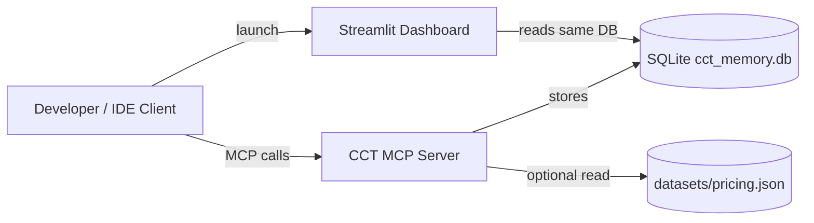
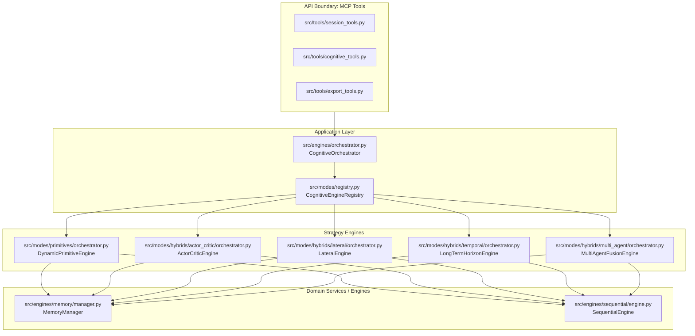
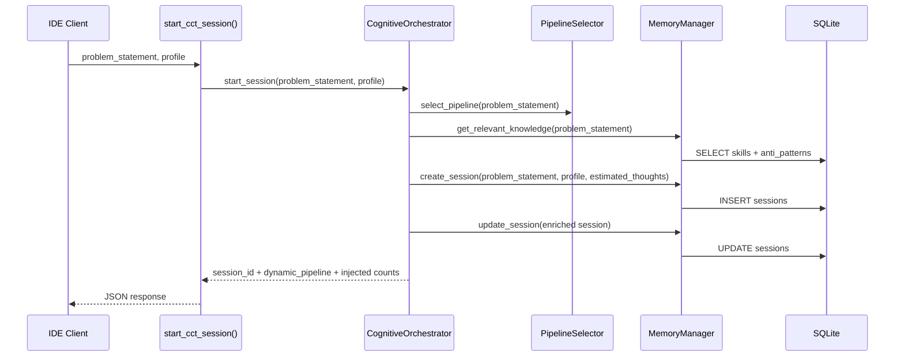
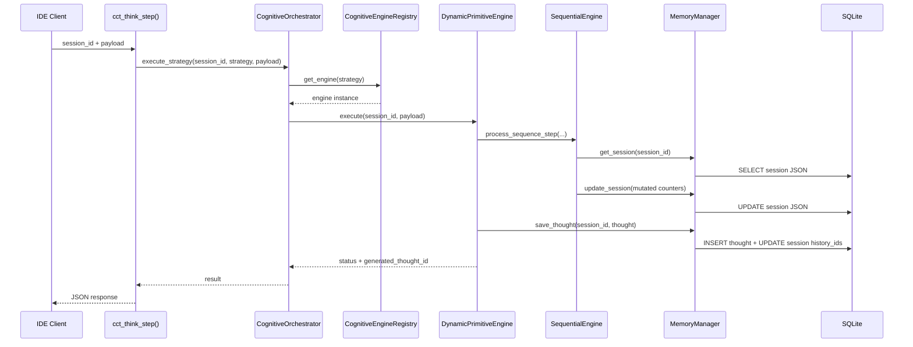
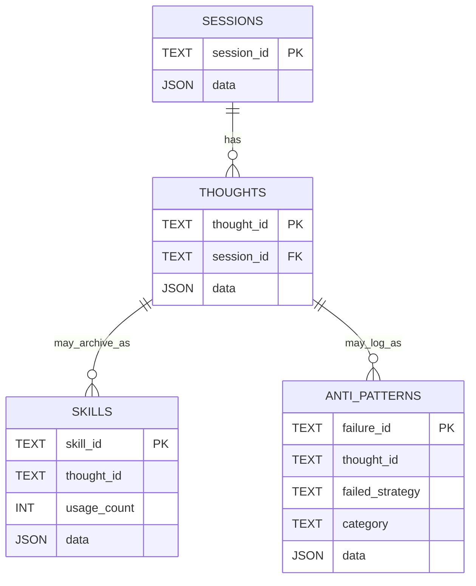

# Architecture Overview

## High-Level Purpose

CCT MCP Server menyediakan “reasoning structure” untuk LLM melalui:

- **Session state yang persisten** (SQLite) untuk menyimpan sejarah reasoning.
- **Strategy registry** untuk memilih mesin (primitive/hybrid) berdasarkan `ThinkingStrategy`.
- **Sequential integrity** untuk mencegah “skip step” atau hallucination pada urutan berpikir.
- **Tool boundary** (MCP tools) sebagai API publik untuk memulai session, menjalankan step, dan export/analyze.

## System Context (C4: Context)

## Container/Component View (C4: Component)

## Runtime Flow (Sequence)

### 1) Start Session

### 2) Think Step (Primitive)

## Data Model & Storage (SQLite)

### Logical Tables

- `sessions(session_id, data JSON)` — `CCTSessionState` sebagai JSON blob.
- `thoughts(thought_id, session_id, data JSON)` — `EnhancedThought` sebagai JSON blob.
- `skills(skill_id, thought_id, usage_count, data JSON)` — `GoldenSkill`.
- `anti_patterns(failure_id, thought_id, failed_strategy, category, data JSON)` — `AntiPattern`.

## Key Design Patterns

- **Facade / Application Service**: `CognitiveOrchestrator` sebagai single entry point untuk eksekusi strategi.
- **Registry + Factory**: `CognitiveEngineRegistry` memetakan `ThinkingStrategy` → engine; primitives memakai `DynamicPrimitiveEngine` untuk menghindari duplikasi.
- **Document Store Pattern**: SQLite menyimpan Pydantic models sebagai JSON blob untuk fleksibilitas schema.
- **Telemetry & Token Economy** (partial): `ContextPruner` dan `TokenHarness` menyediakan pola untuk kontrol konteks dan biaya.

